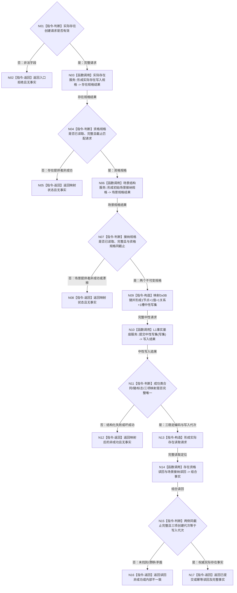

# L1-DATA-LAYER-COMPLETE-P5 发布初始场景实际存在函数流程图 v0.1

更新时间：2026-08-07

## 依据

```text
4015 v0.5、4030 v1.3、4190 v0.3、4200 v1.2
规范/详细设计/20260807_L1-DATA-LAYER-COMPLETE-P5-EXISTENCE-CREATE-CONSUMER_初始场景实际存在创建真实消费者中性写读闭环详细设计_v0.1.md
当前 海中鱼巣/领域/组合.L1实际存在场景.ixx
```

## 身份与边界

正式目标单函数流程图。根函数是待新增的 L2 场景领域原子发布者；旧组合服务、生产启动、两个规格提供者内部和 L1 内部事务不是本图根函数。

## 函数合同

```text
根函数：初始场景实际存在原子发布服务::发布初始场景实际存在
归属模块 / 文件 / 层级：海中鱼巣.领域.服务.初始场景实际存在原子发布 / 海中鱼巣/领域/服务.初始场景实际存在原子发布.ixx / L2 场景领域
现有或待新增：待新增函数；旧组合创建根改为原样委托
完整签名：实际存在结果 发布初始场景实际存在(const 实际存在创建请求& 请求)
参数：请求；const 引用；只读、调用期有效；非法合同、场景定位、幂等身份或零期望代次返回入口拒绝
返回结果：实际存在结果；成功为已提交/幂等读回且携带完整权威事实；非成功不携带部分事实
被调函数流程图：无；两个规格提供者和 L1 中性 CRUD 使用现有正式公开合同
```

## 流程图



## 节点合同

| 节点 | 类型 | 输入绑定 | 输出 | 事实读写 | 后继条件 | 验证 |
| --- | --- | --- | --- | --- | --- | --- |
| N01—N02 | 判断/返回 | 公开请求 | 入口拒绝 | 无 | 请求非法 | 依赖调用 0 |
| N03—N05 | 调用/判断/返回 | 合同、规则、截止 | 资格规格或非成功 | 只经存在服务读 | 资格规格完整 | 恰一次提供者调用 |
| N06—N08 | 调用/判断/返回 | 场景定位、截止 | 接纳规格或非成功 | 只经场景服务读 | 双规格同截止 | 恰一次提供者调用 |
| N09 | 构造 | 双规格、幂等身份 | 中性写集 | 无权威写 | 形状固定 | 1+1+1+1、退出0 |
| N10 | 函数调用 | 中性写集→请求 | 中性写入结果 | L1 一个原子事务 | 调用完成 | 恰一次提交 |
| N11—N13 | 判断/返回/构造 | 结构化写入结果 | 三编码定位 | 无新增写 | 成功形状完整 | 键、标志、映射唯一 |
| N14—N16 | 调用/判断/返回 | 定位→两事实所有者 | 完整实际存在事实 | 精确读取当前权威事实 | 同截止且创建代次匹配 | 不扫描完整快照 |
| N17 | 返回 | 写入状态、事实 | 完整实际存在结果 | 无 | 成功 | 结构化结果完整 |

## 关键边界

```text
发布者归属场景领域，直接成员关系只有这一写门；存在资格语义仍由存在服务拥有。
旧组合服务只原样委托本根，不再拥有 L1 引用、写集、事务、状态映射或缓存。
不调用 legacy 探测、完整快照、带标签提交、审计、恢复或 SQL。
本图不证明生产接线、精确重复实跑、非法请求、修改、退出/历史、特征或整个 L1 完善。
```
