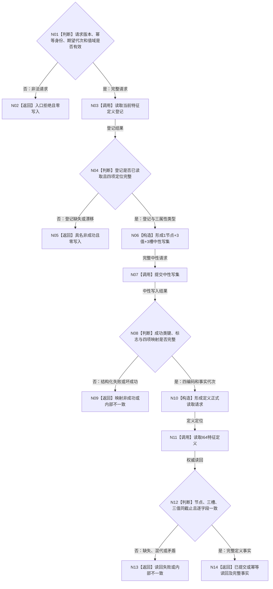

# L1-DATA-LAYER-COMPLETE-P6 建立并复用 I64 特征定义函数流程图 v0.1

更新时间：2026-08-07

## 依据

```text
4015 v0.5、4030 v1.3、4110 v0.3、ACCEPTANCE-01 v0.3
规范/详细设计/20260807_L1-DATA-LAYER-COMPLETE-P6-FEATURE-DEFINITION-CONSUMER_I64特征定义真实消费者中性幂等写读闭环详细设计_v0.1.md
当前 海中鱼巣/领域/服务.L1特征定义.ixx
```

## 函数合同

```text
根函数：L1特征定义服务::建立I64特征定义
归属：第二层特征定义领域
完整签名：I64特征定义结果 建立I64特征定义(const I64特征定义建立请求& 请求)
输入：合同、规则、幂等身份、期望事实代次、I64下界和上界
输出：首次成功、幂等读回或具名非成功；成功类携带完整定义事实和三个值编码
边界：不直连仓库，不预探测，不读取完整快照，不形成业务标签或执行证据
```

## 流程图



## 节点合同

| 节点 | 输入 | 输出 | 权威读写 | 固定门禁 |
| --- | --- | --- | --- | --- |
| N01—N02 | 公开请求 | 入口拒绝 | 无 | 非法值域不调用 L1 |
| N03—N05 | 当前登记定位 | 当前登记或非成功 | 中性精确读 | 不以前后代次推进阻断精确重复 |
| N06 | 登记与请求 | 中性写集 | 无 | 1 节点、3 值、3 槽、0 关系、0 退出 |
| N07 | 中性写集 | 中性写入结果 | 一个 L1 原子事务 | 恰一次提交 |
| N08—N10 | 写入结果 | 四编码读取定位 | 无新增写 | 映射完整唯一 |
| N11—N13 | 正式读取请求 | 完整定义或非成功 | 中性节点/属性/值读 | 首末同代次 |
| N14 | 写入状态与读回 | 结构化领域结果 | 无 | 首次/重复分账 |

## 关键边界

```text
同一完整中性请求由 L1 最小幂等返回精确重复；同键不同合法值域返回冲突。
冲突和非法请求均通过同一领域正式读取证明最终定义零变化。
本图不证明实例特征、当前值换代、退出/历史或整个第一层完善。
```
