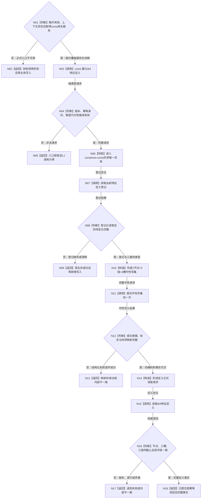

# L1-DATA-LAYER-COMPLETE-P6 建立并复用 I64 特征定义函数流程图 v0.2

更新时间：2026-08-07

替代版本：v0.1；本版补齐正式 const 租约链的写入口可达性

## 依据

```text
0050 v0.7、4015 v0.5、4030 v1.3、8120 v0.2、ACCEPTANCE-01 v0.3
规范/详细设计/20260807_L1-DATA-LAYER-COMPLETE-P6-FEATURE-DEFINITION-CONSUMER_I64特征定义真实消费者中性幂等写读闭环详细设计_v0.2.md
当前 海中鱼巣/启动.运行期上下文.ixx
当前 海中鱼巣/领域/服务.L1特征定义.ixx
```

## 函数合同

```text
根函数：L1特征定义服务::建立I64特征定义 const 重载
归属：第二层特征定义领域唯一写服务
完整签名：I64特征定义结果 建立I64特征定义(
    const I64特征定义建立请求& 请求) const
合法调用链：有效运行期租约 -> const 运行期上下文* -> const L1特征定义服务&
输入：合同、规则、幂等身份、期望事实代次、I64下界和上界
输出：首次成功、幂等读回或具名非成功；成功类携带完整定义事实和三个值编码
生命周期：服务引用只在持有有效租约期间使用
并发：const/non-const 重载共享唯一服务锁、定位和实现
边界：不暴露可变上下文或 L1，不直连仓库，不建立验收专用入口
```

## 流程图



## 节点合同

| 节点 | 输入 | 输出 | 权威读写 | 固定门禁 |
| --- | --- | --- | --- | --- |
| N01—N03 | 会话启动结果与租约 | const 具名服务调用 | 无 | 不取得可变上下文、L1 或仓 |
| N04—N05 | 公开请求 | 入口拒绝 | 无 | 非法值域不调用 L1 |
| N06—N09 | 唯一锁与当前登记定位 | 当前登记或非成功 | 中性精确读 | 两种重载同实现、同锁、同定位 |
| N10 | 登记与请求 | 中性写集 | 无 | 1 节点、3 值、3 槽、0 关系、0 退出 |
| N11 | 中性写集 | 中性写入结果 | 一个 L1 原子事务 | 恰一次提交 |
| N12—N14 | 写入结果 | 四编码读取定位 | 无新增写 | 映射完整唯一 |
| N15—N17 | 正式读取请求 | 完整定义或非成功 | 中性节点/属性/值读 | 首末同代次 |
| N18 | 写入状态与读回 | 结构化领域结果 | 无 | 首次/重复分账 |

## 关键边界

```text
const 表示调用方只持有不可变上下文和具名服务视图，不表示领域写函数无业务副作用。
写权只存在于 L1特征定义服务公开强类型函数内部；L1 引用、锁和定位不向调用方泄漏。
非 const 重载只转发同一 const 实现，不能形成第二状态机或第二幂等门。
同一完整中性请求由 L1 返回精确重复；同键不同合法值域返回冲突。
冲突和非法请求均通过同一领域正式读取证明最终定义零变化。
本图不证明实例特征、当前值换代、退出/历史或整个第一层完善。
```
