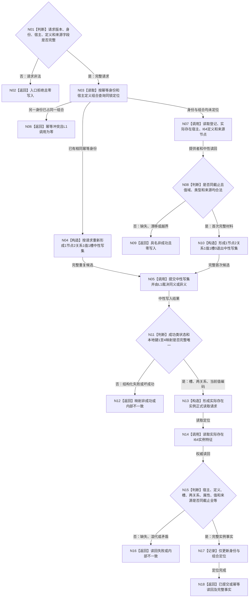

# L1-DATA-LAYER-COMPLETE-P7 建立并复用实际存在 I64 实例特征函数流程图 v0.1

更新时间：2026-08-07

## 依据

```text
4015 v0.5、4030 v1.3、4110 v0.7、ACCEPTANCE-01 v0.3
规范/详细设计/20260807_L1-DATA-LAYER-COMPLETE-P7-EXISTENCE-I64-INSTANCE-FEATURE-CONSUMER_实际存在I64实例特征真实消费者中性关系写读闭环详细设计_v0.1.md
当前 海中鱼巣/领域/服务.L1实例特征.ixx
```

## 函数合同

```text
根函数：L1实例特征服务::建立实际存在I64实例特征
归属：第二层实例特征领域
完整签名：I64实例特征结果 建立实际存在I64实例特征(const 实际存在I64实例特征建立请求& 请求) const
输入：合同、规则、幂等身份、期望事实代次、实际存在宿主、I64定义、初始值和来源节点
输出：首次成功、幂等读回或具名非成功；成功类携带完整实例事实和两关系编码
边界：不直连仓库，不预探测，不读完整快照，不形成业务标签或执行证据
```

## 流程图



## 节点合同

| 节点 | 输入 | 输出 | 权威读写 | 固定门禁 |
| --- | --- | --- | --- | --- |
| N01—N02 | 公开请求 | 入口拒绝 | 无 | 不访问 L1 |
| N03—N06 | 两份非权威定位 | 重复候选、首次候选或组合冲突 | 无 | 不缓存事实副本 |
| N07—N09 | 登记、宿主、定义、来源 | 同截止首次材料或非成功 | 领域公开读 + 中性精确读 | 初始值处于定义区间 |
| N04、N10 | 请求与登记 | 中性写集 | 无 | 1 节点、2 关系、1 值、1 槽、0 退出 |
| N05 | 完整中性写集 | 中性写入结果 | 一个 L1 原子事务 | 恰一次提交 |
| N11—N13 | 写入结果 | 四编码读取定位 | 无新增写 | 映射完整唯一 |
| N14—N16 | 正式读取请求 | 完整实例或非成功 | 中性节点 / 关系 / 属性 / 值读 | 首末同代次 |
| N17—N18 | 权威读回 | 结构化领域结果 | 仅更新非权威定位 | 首次 / 重复分账 |

## 关键边界

```text
同一完整中性请求由 L1 返回精确重复；同键不同写集由 L1 返回幂等冲突。
不同键命中同一实际存在宿主与同一抽象定义时由唯一实例服务写前拒绝第二槽。
本图不证明当前值修改、退出 / 历史、恢复、其它消费者或整个第一层完善。
```
