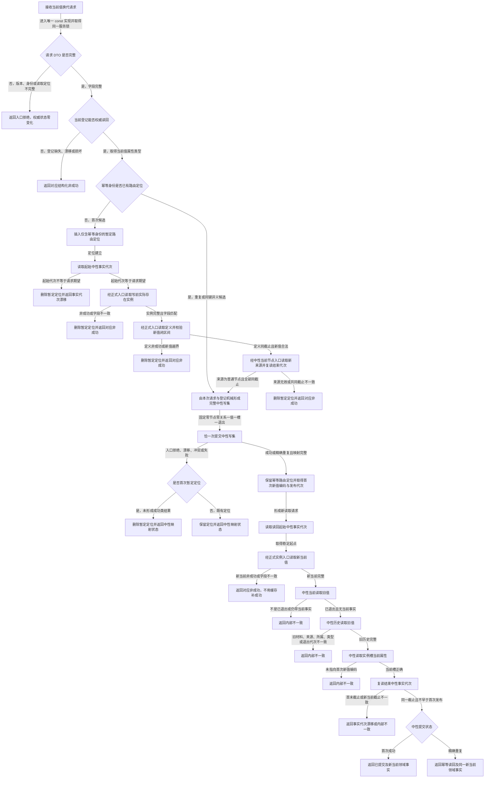

# 换代实际存在 I64 实例特征当前值函数流程图 v0.1

日期：2026-08-07

计划身份：`L1-DATA-LAYER-COMPLETE-P8-EXISTENCE-I64-CURRENT-VALUE-UPDATE-CONSUMER`

目标函数：`L1实例特征服务::换代实际存在I64实例特征当前值(const 实际存在I64实例特征当前值换代请求&) const`

边界：流程不调用幂等预探测、完整快照、legacy 提交、审计或恢复；不缓存首次领域结果。旧值的“删除”只表示当前事实退出，历史仍由正式历史入口回查。
