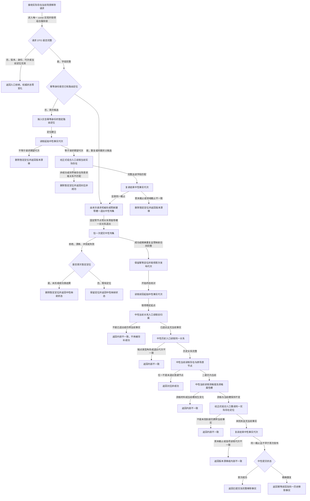

# 移除实际存在当前场景关系函数流程图 v0.1

日期：2026-08-07

计划身份：`L1-DATA-LAYER-COMPLETE-P9-EXISTENCE-CURRENT-SCENE-REMOVE-CONSUMER`

目标函数：`L1实际存在场景组合服务::移除实际存在当前场景(const 实际存在当前场景移除请求&) const`

边界：流程只退出当前场景归属关系，不退出实际存在、资格、场景、特征、状态或动态；不创建新关系，不调用旧世界树骨架，不建立 L1 自检、验收模式、业务证据或恢复材料。
