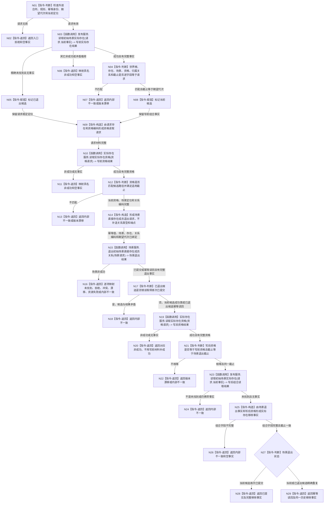

# 移除实际存在当前场景关系函数流程图 v0.2

日期：2026-08-07

## 依据

```text
4030 通用数据服务分层与领域写授权 v1.3
4200 世界树业务服务与同代次完整事实快照 v1.2
P9 实际存在当前场景移除详细设计 v0.2
正式代码基线 cfd8e440f143d939c93b7c15348a789e290bce74
```

## 身份与边界

计划身份：`L1-DATA-LAYER-COMPLETE-P9-EXISTENCE-CURRENT-SCENE-REMOVE-CONSUMER`

本图替代 v0.1。v0.1 把中性提交和读回放在组合服务内，违反组合服务不得直达 L1 的正式依赖方向，不再作为施工依据。

本图只描述一个目标根函数。场景关系退出提供者的内部中性提交与读回由详细设计 v0.2 §5 和代码计划 v0.2 §4 冻结，不在组合根中展开为第二条事实解释链。

## 函数合同

```text
根函数：L1实际存在场景组合服务::移除实际存在当前场景
归属模块：海中鱼巣.领域.组合.L1实际存在场景
归属文件：海中鱼巣/领域/组合.L1实际存在场景.ixx
语义层：L2 组合服务
现有或待新增：待新增
完整签名：实际存在当前场景移除结果 移除实际存在当前场景(const 实际存在当前场景移除请求& 请求) const
参数：请求；const 借用，只在本次调用存续，不保存
返回：调用方拥有的值式实际存在当前场景移除结果
事实写入：本函数不直接写事实；只恰一次委托场景结构服务
被调提供者：初始场景实际存在原子发布服务、L1实际存在服务、L1场景结构服务
禁止依赖：L1事实基座服务、中性写集、中性读取、仓库、锁、路由缓存、日志判定
```

## 流程图



## 节点合同

| 节点 | 类型 | 输入绑定 | 输出绑定 | 事实读写 | 后继条件 |
| --- | --- | --- | --- | --- | --- |
| N01 | 指令-判断 | `请求` | 有效 / 无效 | 无 | 无效到 N02，有效到 N03 |
| N03 | 函数调用 | `请求.当前事实` | 写前实际存在结果 | 经具名发布服务只读 | 当前事实到 N04，精确未找到到 N05，其余到 N06 |
| N04 | 指令-判断 | 请求与写前实际存在事实 | 当前候选字段与截止结论 | 无 | 匹配到 N08，不匹配到 N07 |
| N05 | 指令-赋值 | 精确未找到结果 | 已退出候选标记 | 无 | 到 N09 |
| N09 | 指令-构造 | 请求存在和资格编码 | 资格读取请求 | 无 | 到 N10 |
| N10 | 函数调用 | 资格读取请求 | 写前资格结果 | 经具名实际存在服务只读 | 成功到 N12，其余到 N11 |
| N12 | 指令-判断 | 写前资格与当前 / 已退出候选 | 资格和适用截止结论 | 无 | 匹配到 N14，不匹配到 N13 |
| N14 | 指令-构造 | 外层幂等值、场景定位、当前存在见证、关系编码和期望代次 | 场景退出请求 | 无 | 完整材料到 N15 |
| N15 | 函数调用 | 场景退出请求 | 场景退出结果 | 由唯一场景事实所有者完成一条关系退出与终态读回 | 成功类到 N17，其余到 N16 |
| N17 | 指令-判断 | 候选类型与场景成功状态 | 路径一致性结论 | 无 | 一致到 N19，矛盾到 N18 |
| N19 | 函数调用 | 同一资格读取请求 | 写后资格结果 | 经具名实际存在服务只读 | 成功到 N21，其余到 N20 |
| N21 | 指令-判断 | 写前 / 写后资格与场景截止 | 不变且同截止结论 | 无 | 一致到 N23，不一致到 N22 |
| N23 | 函数调用 | 原实际存在定位 | 写后组合读取结果 | 经具名发布服务只读 | 精确未找到到 N25，其余到 N24 |
| N25 | 指令-构造 | 场景退出事实、写后资格 | 实际存在移除事实 | 无 | 完整到 N27，不完整到 N26 |
| N27 | 指令-判断 | 候选类型与场景退出状态 | 首次 / 精确重复 | 无 | 当前首次到 N28，精确重复到 N29 |

所有返回节点都返回 `实际存在当前场景移除结果`。N02、N06、N07、N11、N13、N16、N18、N20、N22、N24、N26 的事实字段为空；N28、N29 的事实字段完整。

## 关键边界

```text
组合根对 L1 的直接调用数为 0。
组合根形成中性写集、中性幂等键和中性状态映射的数量均为 0。
组合根对场景退出提供者恰一次委托。
关系业务准入、0+0+0+0+1 中性提交、当前关系已退出和历史关系完整读回只属于场景结构服务。
实际存在资格的写前和写后读回只属于实际存在服务。
组合根只在三个具名领域结果字段和事实截止一致时形成成功。
不建立自检、验收入口、日志判定、幂等路由、恢复材料或第二事实解释者。
```

## 验证

1. 单一 Mermaid，根函数只有 `L1实际存在场景组合服务::移除实际存在当前场景`。
2. 每个执行节点明确为函数调用或本函数内指令；所有边具备条件或传递材料。
3. 图中不存在 L1、仓库、中性写集或中性读取调用节点。
4. 详细设计 v0.2 §5 唯一冻结被调场景退出函数的中性写入和读回合同。
5. 不生成或同步 HTML。
