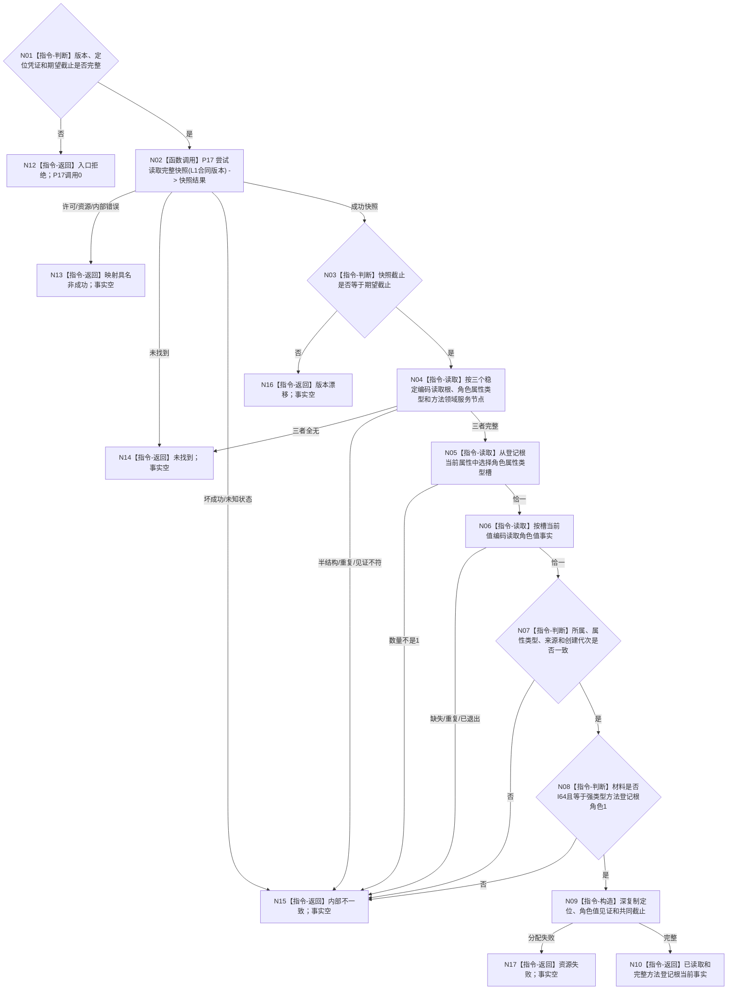

# L1-SIMPLIFY-METHOD-ROOT-R1-CURRENT-READ 读取当前方法登记根函数流程图 v0.1

更新时间：2026-08-07

## 依据

```text
3300、4015、5300；SELF-GOV-CLOSURE v0.2；
BIZ-L4-001-03-01-01；同名v0.1详细设计；P17冻结合同；
正式代码基线0cd4b94fb2ca62477b38e7d43e76314bed39e8b8
```

## 身份与边界

正式目标单函数设计图。只读取一个由调用方强类型定位的已发布方法登记根；不生成身份、不发布根、不枚举方法、不写机器事实。

## 函数合同

```text
根函数：L1方法登记根当前读取服务::读取当前方法登记根
归属模块 / 文件 / 层级：方法领域读取provider / 海中鱼巣/领域/服务.L1方法登记根当前读取.ixx / L4
现有或待新增：待新增；后继旧方法服务替换必须复用，不得建立第二解释者
完整签名：方法登记根当前读取结果 L1方法登记根当前读取服务::读取当前方法登记根(const 方法登记根当前读取请求& 请求) const
参数：请求只读借用；含合同/规则版本、强类型定位凭证和非零期望事实截止；函数不保存引用
返回结果：调用方拥有的值式结果；已读取携带完整事实，其它状态载荷为空
被调函数流程图：P17 L1事实基座服务::尝试读取完整快照；其内部流程不在本图重复
```

## 流程图



## 节点合同

| 节点 | 类型 | 参数 / 输入绑定 | 结果 / 输出绑定 | 事实读写 | 后继条件 | 验证 |
| --- | --- | --- | --- | --- | --- | --- |
| N01 | 本函数内指令 | 请求全部字段 | 入口资格 | 无 | 完整才调用P17 | 错版本、零编码、错种类、零截止 |
| N02 | 函数调用 | L1合同版本 | P17完整快照结果 | 只读当前L1 | 成功或短路 | 调用恰一次、无重试 |
| N03 | 本函数内指令 | 快照代次、期望截止 | 同截止资格 | 无 | 相等才解释 | 漂移零载荷 |
| N04—N06 | 本函数内指令 | 快照、定位稳定编码 | 三节点、槽和值 | 只读副本 | 全部唯一完整 | 全无/半结构/重复 |
| N07—N08 | 本函数内指令 | 值事实及强类型角色 | 语义资格 | 无 | 精确一致 | 旧角色值6、错来源、错材料拒绝 |
| N09—N10 | 本函数内指令 | 完整见证 | 深复制结果 | 只写局部返回值 | 构造成功 | 返回后不持引用 |

## 关键边界

```text
唯一根函数；P17之外provider调用0；全部机器事实写入0。
“未找到”只允许三定位节点在完整同截止快照中全部不存在。
定位凭证只能来自后继正式发布结果/读回，不能由名称、主键、日志或默认编码生成。
本图不形成方法登记根写入规格、发布者、方法首、动作入口或本能方法。
当前未覆盖程序崩溃、重启和跨进程恢复。
```
