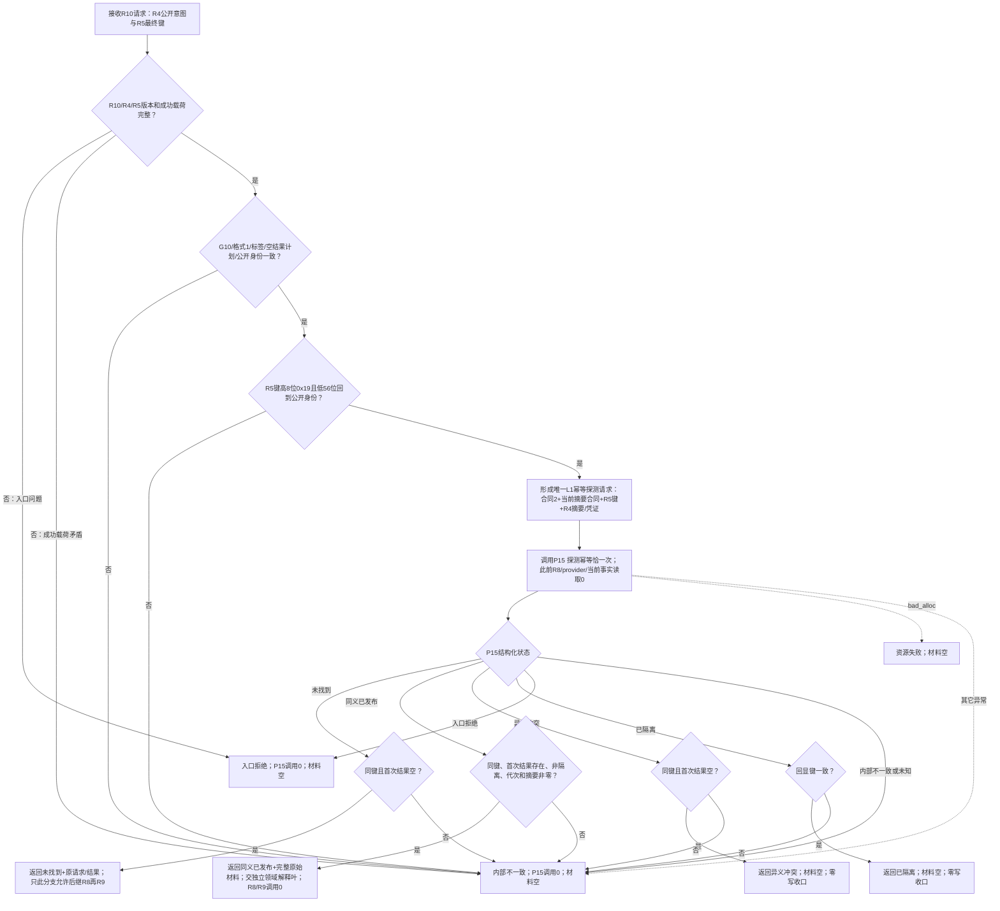

# 探测方法登记根首次发布函数流程图 v0.1

对应计划：`L1-SIMPLIFY-METHOD-ROOT-R10-FIRST-PROBE v0.1`

唯一根函数：
`L1方法登记根首次发布探测服务::探测方法登记根首次发布`

## 边界

- 本图只有一个 Mermaid 块和一个 `flowchart TD` 根。
- 未找到不保证后继提交仍无竞争；最终同键竞争仍由 P15 提交事务裁决。
- 同义材料不等于方法登记根领域读回；R2/R1 角色与五项读回解释不在本函数。
- 全部分支均不形成 R8/provider 证据、R9 执行请求、稳定编码、事务、提交、发布或读回。
- 日志只供同一生产程序人读观察，不参与任何判断。
