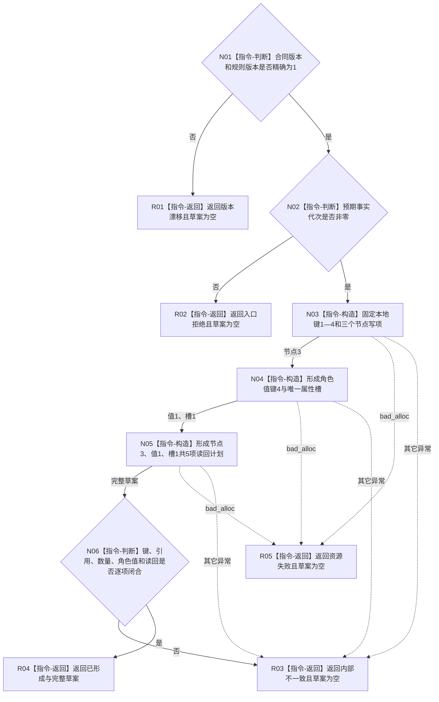

# 形成方法登记根首次 L1 草案函数流程图 v0.1

更新时间：2026-08-07

## 依据

```text
3300、4015、5300；SELF-GOV-CLOSURE v0.2；
BIZ-L4-001-03-01-02；L1-SIMPLIFY-METHOD-ROOT-R1-CURRENT-READ v0.1；
方法登记根首次L1写集与读回草案详细设计 v0.1
```

## 身份与边界

正式目标单函数流程图。唯一根函数只形成纯值草案；不读取当前仓，不分配稳定编码，不形成
幂等/摘要/标签/事务，不提交或读回事实。

## 函数合同

```text
根函数：L1方法登记根首次写集数据操作::形成方法登记根首次L1草案
归属模块 / 文件 / 层级：海中鱼巣.领域.数据操作.L1方法登记根首次写集 / 海中鱼巣/领域/数据操作.L1方法登记根首次写集.ixx / L4
现有或待新增：待新增
完整签名：方法登记根首次L1草案结果 形成方法登记根首次L1草案(const 方法登记根首次写集请求& 请求) const noexcept
参数：请求为只读借用；含合同版本、规则版本和非零预期事实代次；调用期间有效
返回结果：值式五态结果；仅已形成携带不可变草案；全部非成功草案为空
被调函数流程图：无；全部节点都是本函数内具体指令
```

## 流程图



## 节点合同

| 节点 | 类型 | 参数 / 输入绑定 | 结果 / 输出绑定 | 事实读写 | 后继条件 | 验证 |
| --- | --- | --- | --- | --- | --- | --- |
| N01 | 本函数内判断 | 请求版本 | 兼容或漂移 | 零读写 | 精确为1 | 两版本矩阵 |
| N02 | 本函数内判断 | 预期事实代次 | 合法截止或拒绝 | 零读写 | 非零 | 0/非零 |
| N03 | 本函数内构造 | 固定键1—3 | 普通根、I64属性类型、普通服务 | 零事实写入 | 节点3 | 键/种类/表示 |
| N04 | 本函数内构造 | 键1—3、固定角色1 | 值键4和唯一槽 | 零事实写入 | 值1、槽1 | 所属/属性/来源/材料 |
| N05 | 本函数内构造 | 全部写项 | 五项通用读回计划 | 零事实读取 | 计划完整 | 顺序和逐字段覆盖 |
| N06 | 本函数内判断 | 草案 | 完整或坏草案 | 零读写 | 3/0/1/1/0/5 | 连续键、引用、数量 |
| R01—R05 | 本函数内返回 | 分支状态 | 五态结果 | 零读写 | 函数结束 | 非成功草案空 |

## 关键边界

```text
“首次”是草案用途，不是仓内不存在或发布唯一性的证明。
后继发布者另行冻结G组、标签、幂等域、确定编码、provider前探测、事务和映射互证。
映射键1—3/4只有在正式发布及读回成功后才能形成R1定位凭证/角色值见证。
旧角色值6、名称、旧主键、旧句柄、默认稳定编码和日志均不是输入或身份来源。
本函数不覆盖P16、安全、服务候选、因果、生产接线或跨进程恢复。
```
