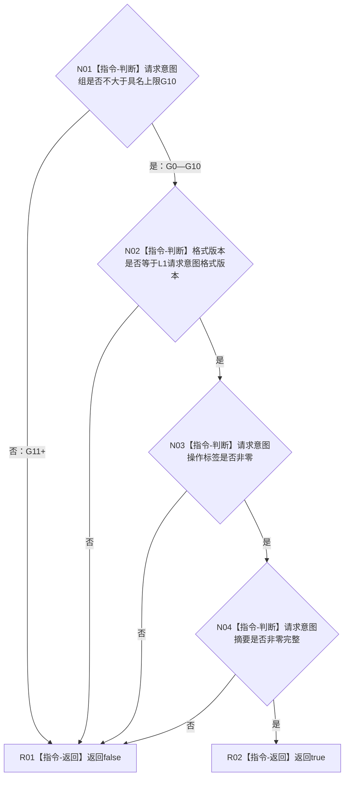

# 扩展后校验 L1 领域意图凭证完整函数流程图 v0.1

更新时间：2026-08-07

## 依据

```text
4015、4030—4050；P15 v0.29当前代码合同；
P78 G9扩展 v0.1；R1/R2 v0.1；
L1方法登记根领域意图组G10扩展详细设计 v0.1
```

## 身份与边界

正式目标单函数流程图。只原位扩展现有公共凭证形状验证器的组上限；不形成方法根生产意图、
写集、执行证据、幂等账或发布结果。

## 函数合同

```text
根函数：L1领域意图凭证完整
归属模块 / 文件 / 层级：海中鱼巣.核心.合同.L1事实基座 / 海中鱼巣/核心/L1事实基座.数据.h / L1
现有或待新增：现有唯一根函数原位扩展
完整签名：bool L1领域意图凭证完整(const L1领域意图凭证& 凭证) noexcept
参数：凭证为只读借用；含U8组号、格式版本、操作标签、请求意图摘要和领域结果计划摘要
返回结果：bool；全部四项公共形状门禁成立返回true，否则false；零事实变化
被调函数流程图：无；摘要非零复用平凡完整谓词，不另建流程图
```

## 流程图



## 节点合同

| 节点 | 类型 | 参数 / 输入绑定 | 结果 / 输出绑定 | 事实读写 | 后继条件 | 验证 |
| --- | --- | --- | --- | --- | --- | --- |
| N01 | 本函数内判断 | 凭证.请求意图组 | G0—G10或G11+ | 零读写 | 不大于10 | G0/G8/G9/G10/G11/255 |
| N02 | 本函数内判断 | 凭证.请求意图格式版本 | 兼容或拒绝 | 零读写 | 精确当前版本 | 当前/错版本 |
| N03 | 本函数内判断 | 凭证.请求意图操作标签 | 非零或拒绝 | 零读写 | 非零 | 0/夹具值 |
| N04 | 本函数内判断 | 凭证.请求意图摘要 | 完整或拒绝 | 零读写 | 至少一字节非零 | 零/非零摘要 |
| R01/R02 | 本函数内返回 | 四项判断 | false/true | 零读写 | 函数结束 | 全分支 |

## 关键边界

```text
G9继续由P78所有；G10只分配给方法登记根；G11+未分配并拒绝。
本函数不验证生产标签、入口变体、幂等域、方法DTO或写集内容。
0x1501C00F只属于隔离自检夹具，不是方法根生产标签。
不得从硬编码8直接越过尚未实现的P78，也不得在本叶形成任何因果事实。
日志只供同一生产程序人读观察，不是机器事实或完成证明。
```
