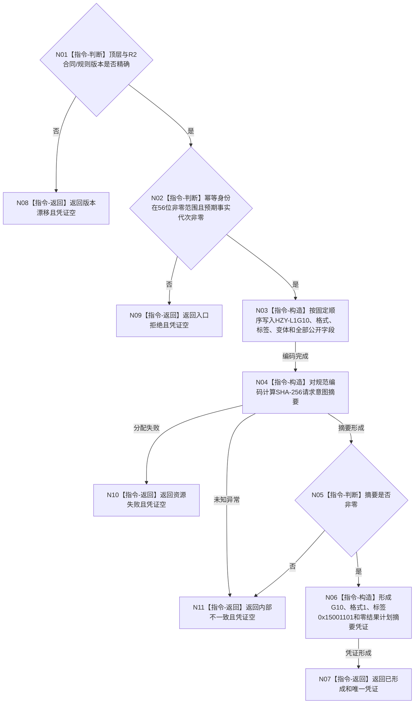

# 形成 G10 方法登记根首次发布意图凭证函数流程图 v0.1

更新时间：2026-08-07

## 依据

```text
3300、4015、4030、5300；R2 v0.1、R3 v0.1；当前 L1 公共凭证与确定编码合同
```

## 身份与边界

正式目标单函数设计图。只由公开请求形成纯值 G10 凭证；不读取事实、不映射幂等键、不分配
稳定编码、不形成执行证据且不提交。

## 函数合同

```text
根函数：形成G10方法登记根首次发布意图凭证
归属模块 / 文件 / 层级：海中鱼巣.领域.协议.L1方法登记根发布意图 / 海中鱼巣/领域/协议.L1方法登记根发布意图.ixx / L4
现有或待新增：待新增
完整签名：方法登记根首次发布意图结果 形成G10方法登记根首次发布意图凭证(const 方法登记根首次发布意图请求& 请求) noexcept
参数：请求为只读借用；含顶层合同/规则、56位非零幂等身份和完整R2写集请求；调用期间有效
返回结果：调用方拥有的值式结果；已形成时唯一携带完整G10凭证，其它状态凭证为空
被调函数流程图：无；版本判断、字段编码、SHA-256和结果构造均为本函数内具体指令
```

## 流程图



## 节点合同

| 节点 | 类型 | 参数 / 输入绑定 | 结果 / 输出绑定 | 事实读写 | 后继条件 | 验证 |
| --- | --- | --- | --- | --- | --- | --- |
| N01 | 指令-判断 | 请求内两层版本 | 版本是否精确 | 无 | 精确/漂移 | 每个版本单独漂移 |
| N02 | 指令-判断 | 幂等身份、R2截止 | 入口资格 | 无 | 合法/拒绝 | 0、56位边界、截止0 |
| N03 | 指令-构造 | 请求全部公开字段 | 规范大端字节序列 | 无 | 编码完成 | 固定向量、字段顺序 |
| N04/N05 | 指令-构造/判断 | 规范编码 | SHA-256摘要 | 无 | 非零/失败 | 标准向量、全零拒绝 |
| N06 | 指令-构造 | 摘要和固定身份 | 完整G10凭证 | 无 | 构造完成 | G10/变体/标签/零结果摘要 |
| N07—N11 | 指令-返回 | 分支状态 | 值式结果 | 无 | 返回 | 非成功凭证全空 |

## 关键边界

```text
同义只看公开输入；R2草案、当前事实、provider、稳定映射、日志和时间不参与编码。
本函数不冻结幂等域，不形成写集幂等键，不选择空仓证据模式，不调用P15或L1。
日志只作为同一生产程序的人读验证证据，不是凭证、业务事实或完成闭环。
未覆盖程序崩溃、异常终止、断电、重启与跨进程恢复。
```
