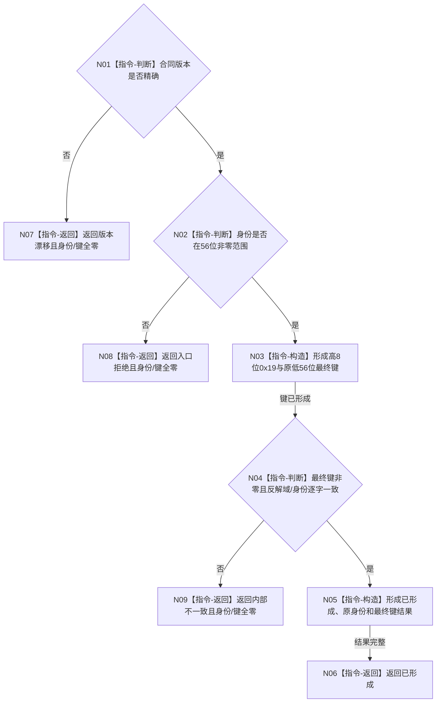

# 形成方法登记根首次发布幂等键函数流程图 v0.1

更新时间：2026-08-07

## 依据

```text
4015、4040、3300、5300；R4 v0.1；当前写集幂等键合同与正式域占用
```

## 身份与边界

正式目标单函数设计图。只把R4强类型公开身份映射为`0x19`域最终键；不做业务唯一准入、
探测、执行证据、稳定编码分配、提交或读回。

## 函数合同

```text
根函数：形成方法登记根首次发布幂等键
归属模块 / 文件 / 层级：海中鱼巣.领域.协议.L1方法登记根发布幂等 / 海中鱼巣/领域/协议.L1方法登记根发布幂等.ixx / L4
现有或待新增：待新增
完整签名：方法登记根首次发布幂等键结果 形成方法登记根首次发布幂等键(const 方法登记根首次发布幂等键请求& 请求) noexcept
参数：请求为只读借用；含合同版本和R4强类型幂等身份；调用期间有效
返回结果：调用方拥有的值式结果；仅已形成携带原身份和非零L1最终键
被调函数流程图：无；版本判断、位域映射、反解互证和返回均为本函数内具体指令
```

## 流程图



## 节点合同

| 节点 | 类型 | 参数 / 输入绑定 | 结果 / 输出绑定 | 事实读写 | 后继条件 | 验证 |
| --- | --- | --- | --- | --- | --- | --- |
| N01 | 指令-判断 | 请求合同版本 | 精确/漂移 | 无 | 两分支 | 版本单项漂移 |
| N02 | 指令-判断 | 强类型身份 | 合法/拒绝 | 无 | 两分支 | 0、1、56位边界、越界 |
| N03 | 指令-构造 | 域0x19、身份低56位 | 最终键 | 无 | 构造完成 | 固定向量、无截断 |
| N04 | 指令-判断 | 最终键 | 反解互证 | 无 | 一致/矛盾 | 高8位、低56位、非零 |
| N05/N06 | 指令-构造/返回 | 原身份、最终键 | 已形成结果 | 无 | 返回 | 逐字段完整 |
| N07—N09 | 指令-返回 | 失败状态 | 身份/键全零结果 | 无 | 返回 | 非成功清空 |

## 关键边界

```text
不同合法身份映射不同技术幂等键，不自动证明业务方法登记根唯一。
空仓证据模式固定禁止；稳定编码只由后继L1独占提交按本地键分配。
函数不调用R1—R4、P15、L1或provider，不读取时间、日志、随机数和当前事实。
日志只作同一生产程序人读验证证据，不是幂等键、机器事实或完成闭环。
未覆盖程序崩溃、异常终止、断电、重启与跨进程恢复。
```
