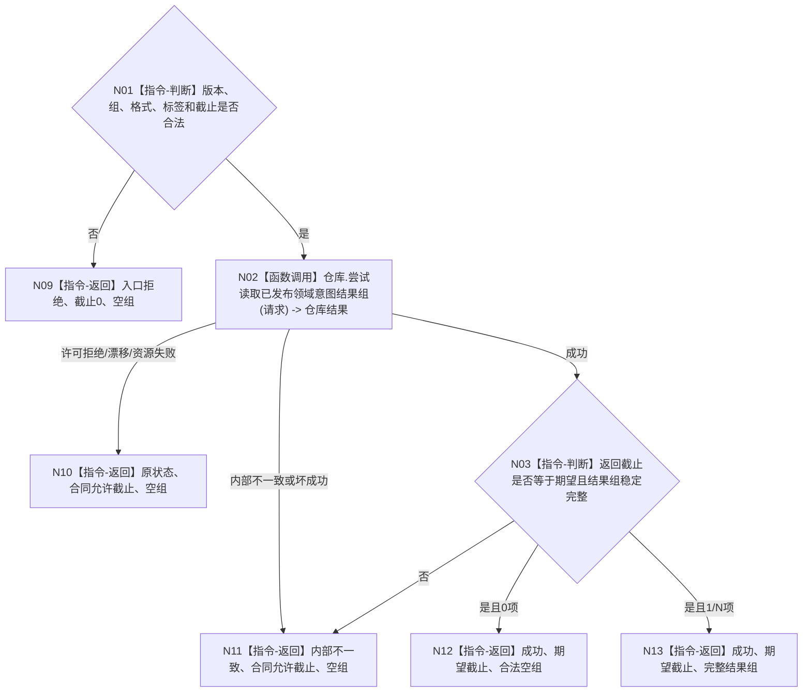

# 尝试读取已发布领域意图结果组函数流程图 v0.1

更新时间：2026-08-07

## 依据

```text
4015、4030；P15 v0.29 当前幂等账；P17 v0.2 非阻塞读取合同；R3—R5 v0.1
规范/详细设计/20260807_L1-SIMPLIFY-METHOD-ROOT-R6-PUBLISHED-INTENT-READ_方法登记根已发布意图结果组读取前置详细设计_v0.1.md
```

## 身份与边界

正式目标单函数设计图。只按领域意图三元组读取完整已发布首次结果组；不解释方法根、不形成
准入、不探测单键、不提交、不恢复。

## 函数合同

```text
根函数：L1事实基座服务::尝试读取已发布领域意图结果组
归属模块 / 文件 / 层级：海中鱼巣/核心/服务.L1事实基座.ixx / L1通用数据服务
现有或待新增：待新增；仓库原位增加同名业务中性非阻塞读取
完整签名：L1已发布领域意图结果组读取结果 L1事实基座服务::尝试读取已发布领域意图结果组(const L1已发布领域意图结果组读取请求& 请求) const
参数：请求为只读借用；含L1合同版本、意图组、格式版本、操作标签和非零期望事实截止
返回结果：调用方拥有的值式结果；状态、事实截止和按发布代次/幂等键稳定排序的完整首次结果组
被调函数流程图：无；仓库同名读取是本函数唯一业务中性数据调用
```

## 流程图



## 节点合同

| 节点 | 类型 | 参数 / 输入绑定 | 结果 / 输出绑定 | 事实读写 | 后继条件 | 验证 |
| --- | --- | --- | --- | --- | --- | --- |
| N01 | 指令-判断 | 全部请求字段 | 合法性 | 无 | 合法/非法 | 逐字段门禁、仓库调用计数 |
| N02 | 函数调用 | 请求逐字段传入仓库 | 仓库不可变结果 | 只读进程内幂等账 | 状态分支 | try-lock、0/1/N、稳定排序 |
| N03 | 指令-判断 | 仓库成功结果 | 完整或坏成功 | 无 | 0项/1N项/坏成功 | 截止、字段、排序、重复 |
| N09—N13 | 指令-返回 | 对应分支材料 | 合同状态与载荷 | 无 | 返回 | 非成功空组、成功空组合法 |

## 关键边界

```text
结果组是已发布写集的幂等账证据，不是方法根当前事实。
空组不证明可跨事务发布；后继仍须与P17同截止快照互证并由P15期望代次拒绝竞争。
禁止从日志、SQL、恢复导出、裸I64值、名称或默认身份补造记录。
未覆盖程序崩溃与跨进程恢复。
```
