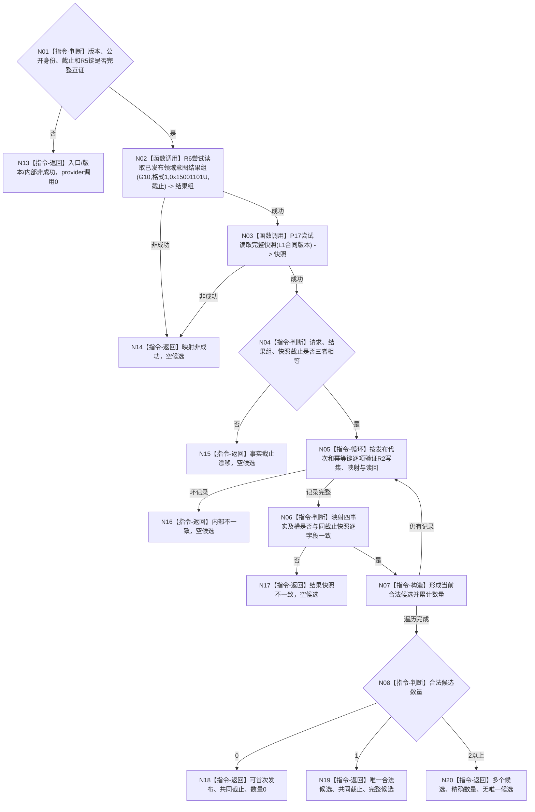

# 判定方法登记根当前唯一准入函数流程图 v0.1

更新时间：2026-08-07

## 依据

```text
3300、4015、4030、5300；P17 v0.2；METHOD-ROOT R1—R6 v0.1
规范/详细设计/20260807_L1-SIMPLIFY-METHOD-ROOT-R7-CURRENT-ROOT-ADMISSION_方法登记根当前唯一准入详细设计_v0.1.md
```

## 身份与边界

正式目标单函数设计图。只协调R6和P17形成当前唯一准入；不形成R4/R5，不探测、不提交、
不持锁、不分配稳定编码。

## 函数合同

```text
根函数：L1方法登记根当前唯一准入服务::判定方法登记根当前唯一准入
归属模块 / 文件 / 层级：海中鱼巣/领域/服务.L1方法登记根当前唯一准入.ixx / 方法领域读取资格层
现有或待新增：待新增；唯一方法登记根首次发布前准入provider
完整签名：方法登记根当前唯一准入结果 L1方法登记根当前唯一准入服务::判定方法登记根当前唯一准入(const 方法登记根当前唯一准入请求& 请求) const
参数：请求为只读借用；含本叶版本、R4公开请求和已形成R5幂等键结果
返回结果：调用方拥有的值式结果；状态、共同事实截止、合法候选数量和可选唯一候选
被调函数流程图：R6尝试读取已发布领域意图结果组函数流程图；P17尝试读取完整快照函数流程图
```

## 流程图



## 节点合同

| 节点 | 类型 | 参数 / 输入绑定 | 结果 / 输出绑定 | 事实读写 | 后继条件 | 验证 |
| --- | --- | --- | --- | --- | --- | --- |
| N01 | 指令-判断 | R4公开请求、R5结果 | 合法入口 | 无 | 合法/非法 | 版本、身份、截止、0x19反解 |
| N02 | 函数调用 | 固定G10/格式/标签/截止 | 全部首次结果组 | 只读幂等账 | 状态 | 0/1/N、调用恰一次 |
| N03 | 函数调用 | L1合同版本 | 当前完整快照 | 只读当前事实 | 状态 | 调用恰一次、许可拒绝 |
| N04 | 指令-判断 | 三个截止 | 共同截止 | 无 | 一致/漂移 | 调用间并发推进 |
| N05—N07 | 指令-循环/判断/构造 | 结果项、映射、读回、快照 | 当前合法候选组 | 无 | 坏项/继续/完成 | R2形状、四事实、槽、禁止跳过 |
| N08 | 指令-判断 | 合法候选组 | 0/1/N分支 | 无 | 数量 | 多候选不得选择 |
| N13—N20 | 指令-返回 | 对应状态材料 | 合同结果 | 无 | 返回 | 非成功空候选、唯一候选载荷 |

## 关键边界

```text
零候选只对共同截止C有效，不是锁；后继必须仍以C提交。
不同身份并发在P15独占代次门最多一笔成功，重试必须重做本函数。
不扫描裸I64、名称、日志或调用方自报定位；坏记录不跳过。
未覆盖程序崩溃与跨进程恢复。
```
