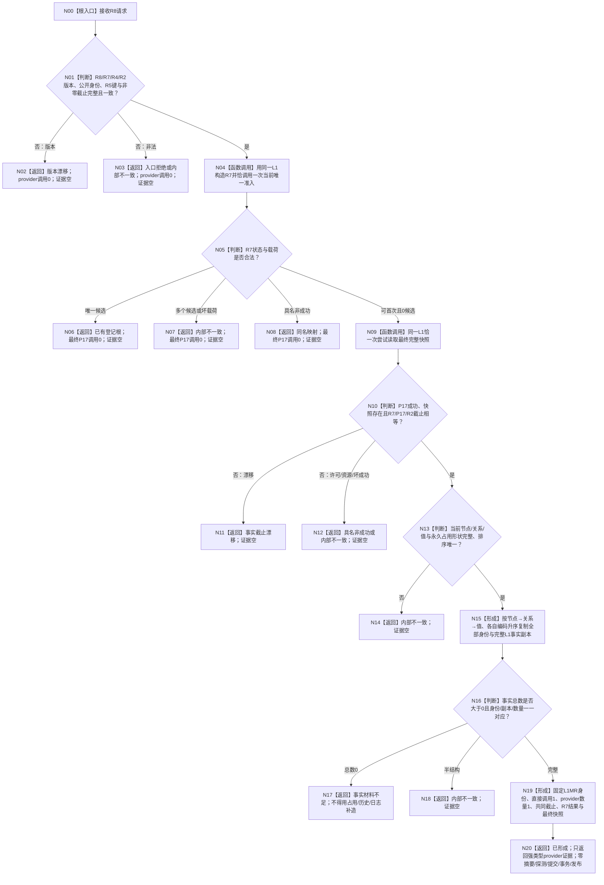

# 形成方法登记根首次发布准入提供者证据函数流程图 v0.1

计划身份：`L1-SIMPLIFY-METHOD-ROOT-R8-FIRST-PUBLISH-PROVIDER-EVIDENCE`

唯一根函数：

```cpp
方法登记根首次发布准入提供者证据结果
L1方法登记根首次发布证据服务::形成方法登记根首次发布准入提供者证据(
    const 方法登记根首次发布准入提供者证据请求& 请求) const;
```

调用前置：领域发布调用方已用 R4 意图和 R5 最终键完成 P15 单键探测，且结果为 `未找到`；
其它探测状态不得调用本函数。本函数不重复探测。



## 节点—机器语义映射

| 节点 | 类型 | 输入 | 输出/状态 | 调用/写入 |
| --- | --- | --- | --- | --- |
| N01 | 入口门 | R8请求、R7请求、R5结果 | 合法/非法 | provider 0 |
| N04 | 具名调用 | 同一 `L1_`、R7请求 | R7结果 | R7恰1 |
| N05 | 状态分账 | R7状态/数量/候选 | 可首次/已有/坏状态 | 最终P17仍0 |
| N09 | 非阻塞读取 | `L1完整快照读取请求` | 最终P17结果 | P17恰1、零写 |
| N10 | 截止门 | R7/P17/R2截止 | 一致/漂移 | 不重试、不跨锁 |
| N13 | 完整性门 | 当前三类事实、永久占用 | 完整/内部不一致 | 不补造 |
| N15 | 纯值形成 | 全量当前事实 | 排序身份组、同索引副本组 | 零摘要 |
| N17 | 合法非成功 | 非零截止但当前事实0 | 事实材料不足 | 不用历史/占用补见证 |
| N19 | 证据闭合 | 固定身份、完整来源 | R8凭证 | 直接调用1/provider1 |
| N20 | 完成边界 | 完整R8凭证 | 已形成 | P15/事务/发布0 |

## 固定边界

1. R8 只拥有准入结果到强类型 provider 证据的转换，不拥有 R7 准入或 L1 事实。
2. R7 内部 R6/P17 为传递调用；后继对 R8 的直接 provider 计数固定为1。
3. 只接受同一 `L1_` 的最终 P17 快照；R7/P17/R2 任一截止不同即漂移。
4. 写前事实是最终快照全部当前节点、关系和值；属性槽只随节点事实，不建立第二权威。
5. 当前事实总数0不等于 P15 空仓模式；返回事实材料不足，不补造见证。
6. 本函数不形成 `L1执行证据材料`、摘要、探测、稳定编码、事务、提交、发布或读回。
7. 正式日志只供人读观察；当前排除崩溃、重启和跨进程恢复。
8. P15 探测非 `未找到` 时本函数调用0；该前置由后继领域发布调用方负责，不用布尔值或令牌伪造。
