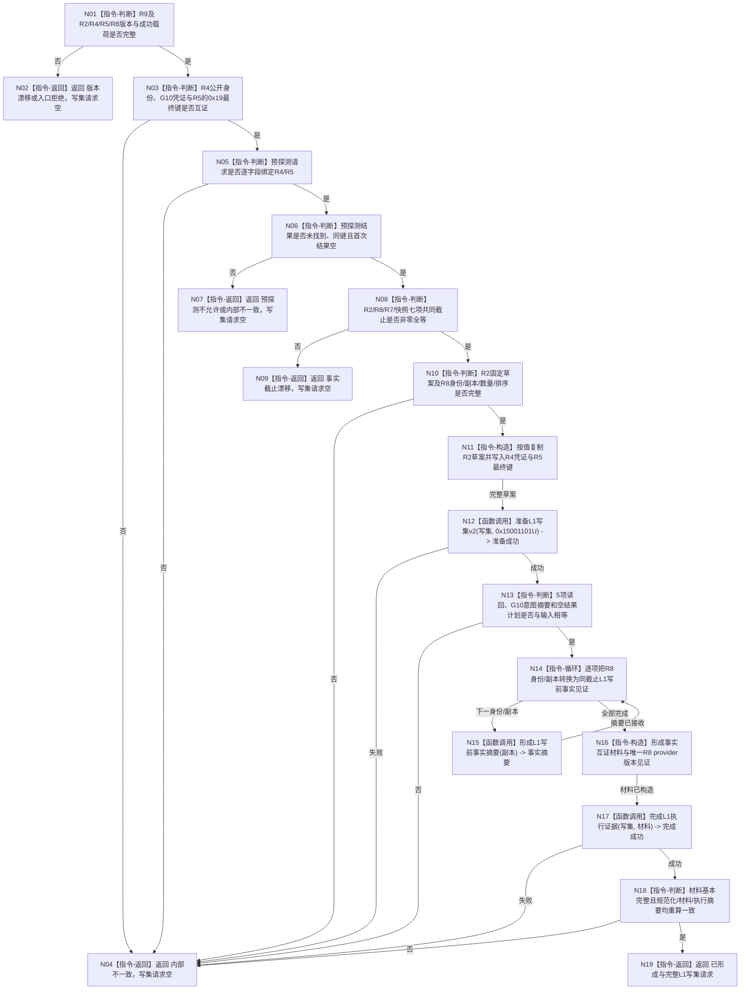

# 形成方法登记根首次发布 L1 执行请求函数流程图 v0.1

更新时间：2026-08-07

## 依据

```text
0050、4015、4030
P15 v0.29 当前公开 L1 DTO 与确定性摘要原语
METHOD-ROOT-R2/R4/R5/R8 v0.1 冻结合同
R9 详细设计 v0.1
```

## 身份与边界

本图是 R9 目标单函数施工图，只描述一个待新增纯值根函数。函数不调用服务、不读取或写入事实，
不执行 P15 探测、稳定编码分配、事务、提交、发布或读回。

## 函数合同

```text
根函数：形成方法登记根首次发布L1执行请求
归属模块：海中鱼巣.领域.数据操作.L1方法登记根首次发布执行请求
物理文件：海中鱼巣/领域/数据操作.L1方法登记根首次发布执行请求.ixx
层级：方法领域纯值数据操作
现有或待新增：待新增
完整签名：方法登记根首次发布执行请求结果
  形成方法登记根首次发布L1执行请求(
    const 方法登记根首次发布执行请求组装请求& 请求) const noexcept
参数：请求；输入 const 引用；调用方拥有且只活到本次调用结束
返回：按值返回状态与可选完整 L1写集请求；仅已形成携带请求
被调函数流程图：无；三个 P15 纯值 helper 按现行公开合同作为叶调用
```

## 流程图



## 节点合同

| 节点 | 类型 | 输入绑定 | 输出 | 事实读写 | 验证 |
| --- | --- | --- | --- | --- | --- |
| N01—N10 | 本函数内判断/返回 | R2/R4/R5/R8及预探测值 | 具名状态 | 0读0写 | 版本、键、截止、载荷矩阵 |
| N11 | 本函数内构造 | R2草案、R4凭证、R5键 | L1写集请求候选 | 0读0写 | 固定写集与5项读回 |
| N12 | 函数调用 | 写集、标签绑定形参 | bool | 0读0写 | P15现行helper标准向量 |
| N14—N16 | 循环/调用/构造 | R8同索引身份与副本 | 执行证据材料 | 0读0写 | 全量、排序、一一对应 |
| N17—N18 | 函数调用/判断 | 写集、材料 | 完整摘要与判定 | 0读0写 | P15现行helper重算一致 |
| N19 | 本函数内返回 | 完整写集 | 已形成 | 0读0写 | 非空材料、双摘要完整 |

## 关键边界

```text
预探测请求与结果必须同时输入，未找到结果不能单独证明意图同义或调用时序。
R8是唯一直接事实provider；其内部R7/R6/P17不重复登记。
摘要编码只由P15既有纯值helper拥有，R9不复制SHA字节合同。
所有非成功返回空写集；稳定编码、事务、提交、发布和读回全部在后继。
```
