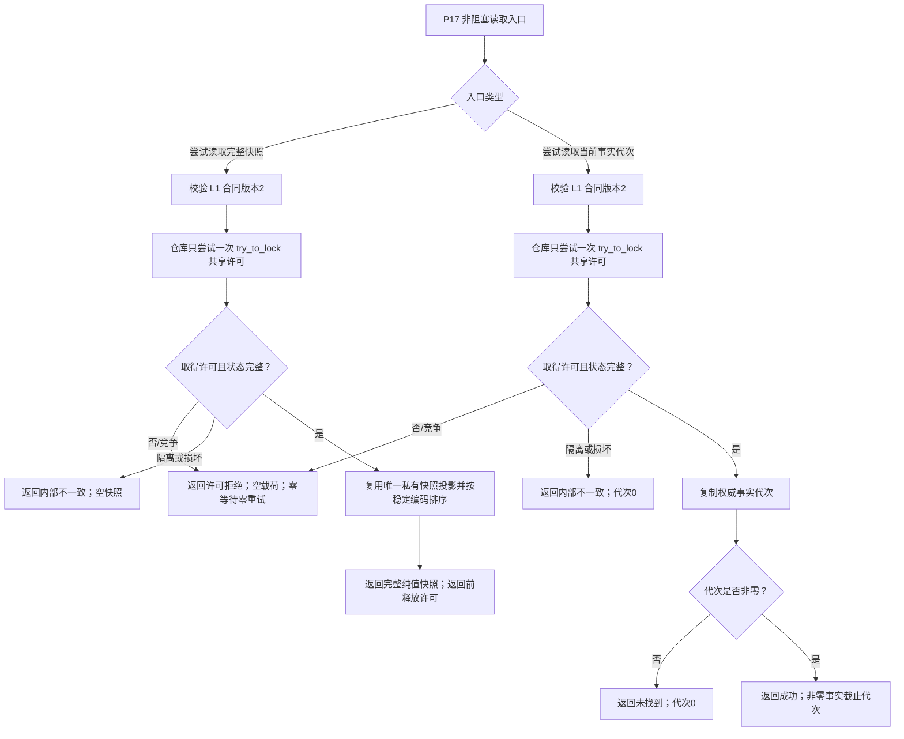

# L1-SIMPLIFY-P17 L1 非阻塞当前快照与事实代次读取函数流程图 v0.2

对应详细设计：`20260807_L1-SIMPLIFY-P17-NONBLOCKING-READ_L1非阻塞当前快照与事实代次读取详细设计_v0.2.md`

本次只替换过期的 P15 v0.2 门禁：P15 v0.29 已提供真实 L1 合同版本2、唯一仓库/服务接口与组件资源；其正式接线失败边界仍保留，不构成 P17 的服务集成 PASS。

P15 v0.29 的正式生产消费者、正式独立读回、自检隔离和跨进程恢复不在本图范围；日志和验收文本不是机器事实。
