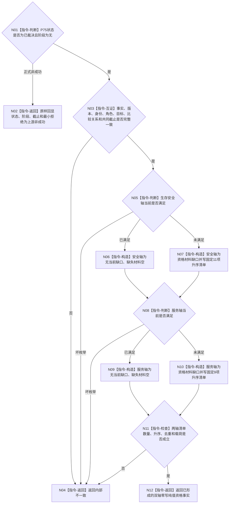

# 形成当前自我双轴根需求缺口资格函数流程图 v0.1

更新时间：2026-08-07

## 依据

```text
规范/3100_根规范_需求_20260720.md
规范/5100_子规范_需求下级规则_20260720.md
规范/5110_子规范_需求树生长机制_20260720.md
规范/5160_子规范_需求正式结算记录与唯一结论.md
规范/6130_子规范_自我根特征抽象定义与自检缺口_20260720.md
P75 v0.1 双轴根需求当前满足协调正式设计合同
```

## 身份与边界

本图是待新增单函数的正式施工图。它只消费调用方已有的 P75 纯值结果，形成零写资格材料
投影；不调用provider，不发布满足或正式结算，不创建需求/任务，不读取或设计因果。

## 函数合同

```text
根函数：形成当前自我双轴根需求缺口资格
归属模块：海中鱼巣.领域.服务.L1自我根需求缺口资格
物理文件：海中鱼巣/领域/服务.L1自我根需求缺口资格.ixx
现有或待新增：待新增
完整签名：自我双轴根需求缺口资格结果 形成当前自我双轴根需求缺口资格(
    const 自我双轴根需求当前满足结果& 当前满足结果) noexcept
参数：一个const借用纯值；函数不保存引用
返回结果：已形成/上游非成功/资源失败/内部不一致
被调函数流程图：无；函数调用数0
```

## 流程图



## 节点合同

| 节点 | 类型 | 输入绑定 | 输出 | 事实读写 | 验证 |
| --- | --- | --- | --- | --- | --- |
| N01—N04 | 本函数内指令 | P75结果 | 上游非成功或坏事实分账 | 只读；零provider | 全状态、阶段、拒绝、坏成功 |
| N05—N10 | 本函数内指令 | 两轴完整当前满足事实 | 两轴资格分类和固定清单 | 零写；不补材料 | 四组合、11项/9项 |
| N11—N12 | 本函数内指令 | 完整投影 | 已形成纯值结果 | 零需求/任务/因果/结算 | 数量、升序、无重复、深复制 |

## 关键边界

```text
P75已经拥有当前满足纯值裁决；本函数不建立第二满足解释者或满足事实发布者。
已满足轴不得生成需求；未满足轴因材料不足也不得直接生成需求或任务。
缺失材料只表示正式入口仍需哪些权威材料，不表示这些材料已不存在或已被本函数查询。
单一生产程序和正式日志只作人读观察；日志不是资格、需求或完成事实。
本图未覆盖因果、正式候选入树、任务化、生产接线、崩溃或跨进程恢复。
```
