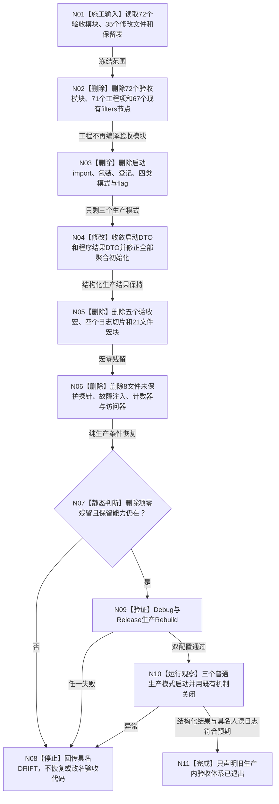

# REMOVE-LEGACY-ACCEPTANCE-CODE 生产内旧验收体系删除闭环流程图 v0.2

更新时间：2026-08-07

## 依据

```text
规范/4015_子规范_L1简化事实基座.md v0.4
规范/8120_子规范_程序入口启动模式与运行宿主边界_20260726.md v0.2
规范/运行期服务导向代码验收与全函数入口巡检规范.md v0.2
规范/日志系统规范.md v0.5
规范/详细设计/20260807_REMOVE-LEGACY-ACCEPTANCE-CODE_生产内旧验收体系物理退出详细设计_v0.2.md
```

## 身份与边界

本图是 `REMOVE-LEGACY-ACCEPTANCE-CODE v0.2` 的单一施工闭环图，不是运行期业务函数图。它只冻结旧生产内验收体系的物理删除、生产能力保留和验证收口；不生成新 CRUD、验收运行器或机器事实。

## 流程图



## 节点合同

| 节点 | 输入 | 输出 | 文件事实变化 | 验证 |
| --- | --- | --- | --- | --- |
| N01 | 正式设计的删除 / 修改 / 保留表 | 唯一施工白名单 | 无 | 文件数、路径、基线一致 |
| N02 | 72 个删除文件、71 个工程项、67 个现有 filters 节点 | 验收模块与编译项归零 | 删除源码与现有工程 / filters 引用 | 文件存在数、工程项与现有 filters 节点均归零 |
| N03 | 启动聚合、入口、启动 DTO | 三生产模式入口 | 删除验收路由 | 四旧 flag 静态零残留 |
| N04 | 程序结果 DTO 与全部聚合初始化 | 三字段生产结果 | 删除专项摘要，生产失败映射到既有状态 | 类型调用点全扫描、双配置编译 |
| N05 | 工程宏、日志宏、21 文件宏块 | 无验收宏生产源码 | 删除宏控制验收代码 | 五宏全仓生产代码零残留 |
| N06 | 8 个未保护承载文件 | 无私有验收入口 | 删除探针并保留正式生产分支 | 具名符号零残留、代码审查 |
| N07 | 静态扫描与保留表 | 继续或停止 | 无 | 保留能力逐项存在 |
| N08 | 任一漂移 / 失败 | 具名失败回执 | 不扩大范围 | 不恢复自检、不修改 legacy 业务合同 |
| N09 | 纯生产工程 | Debug / Release 结果 | 构建产物 | 两配置 Rebuild 成功 |
| N10 | 三个正式启动模式 | 结构化运行结果、人读日志 | 仅运行观察 | 日志不作机器 PASS |
| N11 | 全部门禁通过 | 有限完成声明 | 新记录 | 不宣称 CRUD / 服务验收 |

## 关键边界

```text
生产初始化后置检查、SQL审计、性能遥测、D455生产采集、健康/故障隔离、控制面板投影和具名日志保留。
程序运行期首发失败从旧专项失败改为既有初始化失败，失败阶段仍为生产运行期首发，退出码仍为1。
任何无法公开证明为验收专用的对象均不得在本叶删除。
历史记录不删除，日志不作为机器事实，新黑盒验收不在本叶执行。
```
