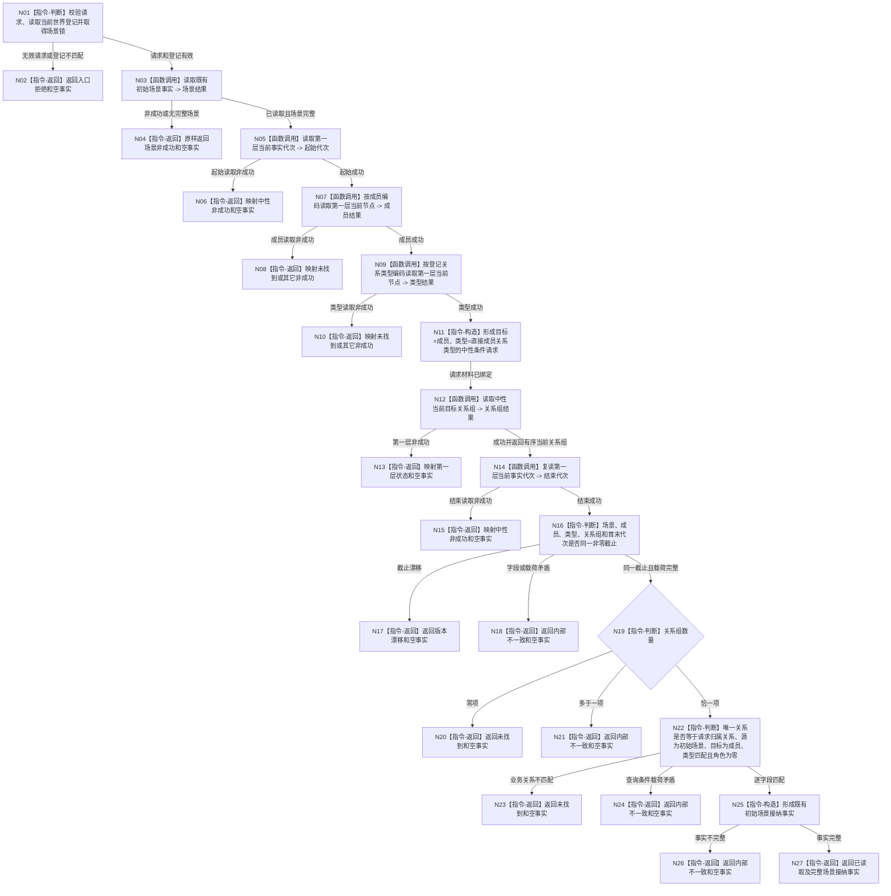

# 读取初始场景接纳唯一关系函数流程图 v0.1

日期：2026-08-08

## 依据与身份

计划身份：`L1-DATA-LAYER-COMPLETE-P10-EXISTENCE-CURRENT-SCENE-RELATION-QUERY-CONSUMER`

正式依据：4015 v0.5、4030 v1.3、4200 v1.2，以及 P5、P7、P9 已发布代码结果。

本图只描述一个第二层真实消费者根。第一层条件关系查询的 DTO、索引候选维护、同锁权威回读和错误合同由 P10 详细设计 §§4—6 与代码计划冻结，不展开为第二个业务根。

## 函数合同

```text
根函数：L1场景结构服务::读取初始场景接纳
内部实现：L1场景结构内部::读取接纳实现
归属模块：海中鱼巣.领域.服务.L1场景结构
归属文件：海中鱼巣/领域/服务.L1场景结构.ixx
语义层：第二层场景事实所有者
公开签名：初始场景接纳结果 读取初始场景接纳(const 初始场景接纳读取请求& 请求) const
参数：请求；const 借用，本次调用内使用，不保存
返回：调用方拥有的值式初始场景接纳结果
事实写入：零
第一层调用：当前代次两次、当前成员节点一次、当前关系类型节点一次、当前目标关系组一次；初始场景读取复用既有实现
禁止依赖：完整快照、历史、审计、恢复材料、SQL、旧管理索引、日志判定
```

## 流程图



## 节点合同

| 节点 | 类型 | 输入 | 输出 | 事实访问 | 后继 |
| --- | --- | --- | --- | --- | --- |
| N01 | 指令-判断 | 请求、世界登记、场景锁 | 有效性结论 | 经登记服务读取 | 有效到 N03，无效到 N02 |
| N03 | 函数调用 | 请求场景定位 | 初始场景结果 | 经既有场景读取实现只读 | 成功到 N05，其余到 N04 |
| N05 | 函数调用 | 中性当前代次请求 | 起始代次 | 第一层正式入口 | 成功到 N07，其余到 N06 |
| N07 | 函数调用 | 请求成员编码 | 成员节点结果 | 第一层正式入口 | 成功到 N09，其余到 N08 |
| N09 | 函数调用 | 登记直接成员关系类型 | 类型节点结果 | 第一层正式入口 | 成功到 N11，其余到 N10 |
| N11 | 指令-构造 | 成员、关系类型 | 中性目标关系请求 | 无 | 到 N12 |
| N12 | 函数调用 | 中性目标关系请求 | 当前关系有序组 | 第一层新正式入口 | 成功到 N14，其余到 N13 |
| N14 | 函数调用 | 中性当前代次请求 | 结束代次 | 第一层正式入口 | 成功到 N16，其余到 N15 |
| N16 | 指令-判断 | 所有读取结果 | 同截止与载荷结论 | 无 | 完整到 N19，漂移到 N17，矛盾到 N18 |
| N19 | 指令-判断 | 当前关系组 | 零 / 一 / 多 | 无 | 零到 N20，一到 N22，多到 N21 |
| N22 | 指令-判断 | 唯一关系、请求、场景、成员、类型 | 业务匹配结论 | 无 | 匹配到 N25，不匹配到 N23，查询矛盾到 N24 |
| N25 | 指令-构造 | 场景、成员、唯一关系、共同截止 | 接纳事实 | 无 | 完整到 N27，不完整到 N26 |

## 关键边界

```text
第一层只返回目标 + 类型条件下的当前关系组，不判断业务唯一性。
第二层场景服务拥有零 / 一 / 多及精确归属的业务解释。
零项是第一层成功空组、第二层未找到。
多项是第一层成功有序组、第二层内部不一致。
普通查询不读取完整快照、历史、审计、恢复、SQL或日志。
根函数写入数为零，不新增自检、验收模式或生产内PASS判定。
```

## 验证

1. 单一 Mermaid，唯一根为 `L1场景结构服务::读取初始场景接纳`。
2. 所有执行节点均为函数调用或本函数内指令，所有边有条件或材料。
3. 图中没有仓库、索引、锁令牌、完整快照、历史、审计、恢复、SQL或日志节点。
4. 第一层条件查询只作为具名中性提供者；第二层不取得第一层内部权限。
5. 不生成或同步 HTML。
