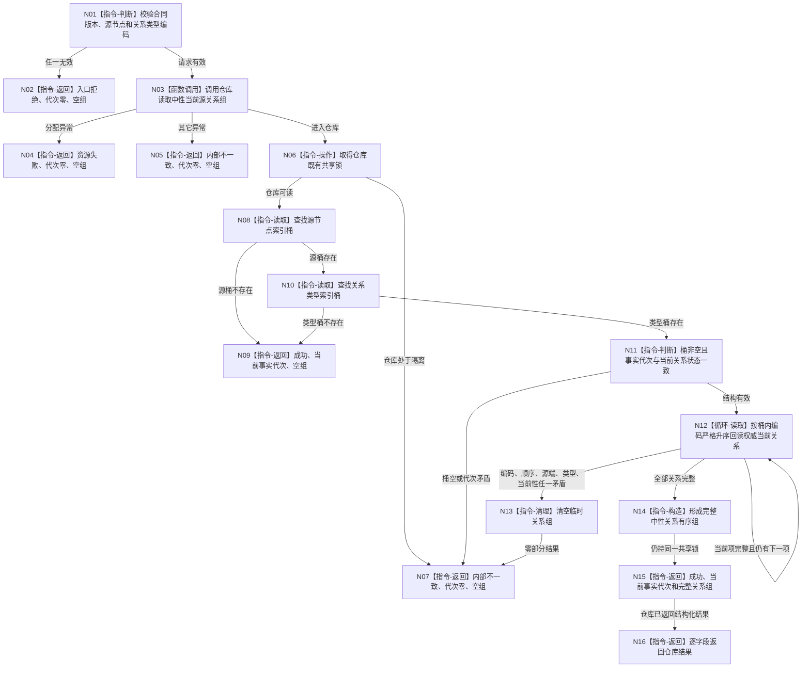

# 读取中性当前源关系组函数流程图 v0.1

日期：2026-08-08

## 依据与身份

计划身份：`L1-DATA-LAYER-COMPLETE-P11-CURRENT-SOURCE-RELATION-QUERY-PROVIDER`

正式依据：4015 v0.5、4030 v1.3、4200 v1.2，以及 P10 已发布代码结果。

本图只描述第一层一个业务中性查询根。源索引在中性 / legacy 提交候选内的插入、删除、纯派生和完整性检查由详细设计 §§5—6 与代码计划冻结，不展开为第二根。

## 函数合同

```text
根函数：L1事实基座服务::读取中性当前源关系组
仓库函数：L1事实基座仓库::读取中性当前源关系组
归属模块：海中鱼巣.核心.服务.L1事实基座 / 海中鱼巣.核心.仓库.L1事实基座
语义层：第一层业务中性数据读取
公开签名：L1中性源关系读取结果 读取中性当前源关系组(const L1中性源关系读取请求& 请求) const
参数：请求；const 借用，本次调用内使用，不保存
返回：调用方拥有的值式结果
事实写入：零
锁：仓库既有共享锁一次
禁止依赖：完整快照、历史、审计、恢复、SQL、旧管理索引、目标查询、日志判定
```

## 流程图



## 节点合同

| 节点 | 类型 | 输入 | 输出 | 事实访问 | 后继 |
| --- | --- | --- | --- | --- | --- |
| N01 | 指令-判断 | 中性源关系请求 | 请求有效性 | 无 | 有效到 N03，无效到 N02 |
| N03 | 函数调用 | 有效请求 | 仓库结构化结果或异常 | 只经仓库公开成员 | 返回到 N16，异常到 N04 / N05 |
| N06 | 指令-操作 | 仓库当前状态 | 一次共享锁 | 仓库锁 | 可读到 N08，隔离到 N07 |
| N08 | 指令-读取 | 源节点编码 | 源索引桶 | 非权威派生索引 | 命中到 N10，未命中到 N09 |
| N10 | 指令-读取 | 关系类型编码 | 类型索引桶 | 同一派生索引 | 命中到 N11，未命中到 N09 |
| N11 | 指令-判断 | 类型桶、事实代次 | 结构结论 | 无额外读取 | 完整到 N12，矛盾到 N07 |
| N12 | 循环-读取 | 桶内关系编码 | 完整关系副本组 | 权威 `当前关系` | 完整到 N14，矛盾到 N13 |
| N14 | 指令-构造 | 全部完整关系副本 | 有序中性关系组 | 无 | 到 N15 |
| N15 | 指令-返回 | 代次、关系组 | 仓库成功结果 | 无 | 返回服务 |
| N16 | 指令-返回 | 仓库结果 | 公开值式结果 | 无 | 结束 |

## 关键边界

```text
源索引只给出候选编码，权威字段仍逐项来自当前关系。
合法零命中是成功空组，不是未找到。
第一层不解释场景、子场景、实际存在、关系角色或业务完整性。
普通查询不调用完整快照、全仓扫描、历史、审计、恢复、SQL、目标查询或日志。
本函数写入数为零，不新增自检或第一层验收。
```

## 验证

1. 单一 Mermaid，唯一根为 `L1事实基座服务::读取中性当前源关系组`。
2. 所有执行节点均为函数调用或本函数 / 仓库函数内指令，所有边有条件或材料。
3. 图中没有第二层业务判断、完整快照、历史、审计、恢复、SQL或日志节点。
4. 关系组只从一个源 + 类型桶候选并在同一共享锁内回读权威当前关系。
5. 不生成或同步 HTML。
