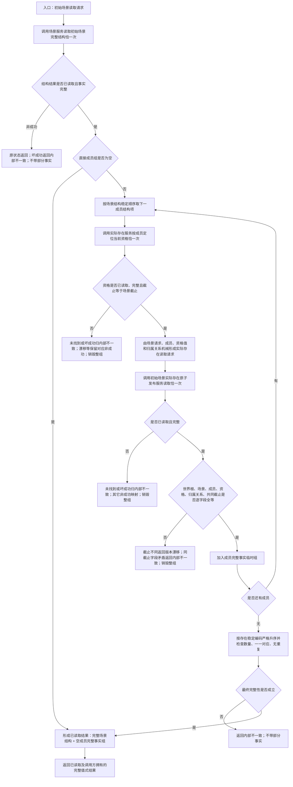

# L1-DATA-LAYER-COMPLETE-P12-INITIAL-SCENE-COMPLETE-FACT-CONSUMER 读取初始场景完整事实函数流程图 v0.1

日期：2026-08-08

根函数：`L1实际存在场景组合服务::读取初始场景完整事实`

## 边界说明

- 场景服务内部才允许调用第一层 P11 源关系查询和 P10 目标关系查询；本根函数对第一层直调为零。
- 零成员是合法成功，实际存在资格与组合事实提供者调用数均为零。
- 任一成员失败都销毁整组，不返回部分成功，不重试、不等待、不读取完整快照、SQL、材料、缓存或日志。
- 图只冻结初始场景、直接子场景和直接成员的完整事实读取，不代表完整世界树快照。
