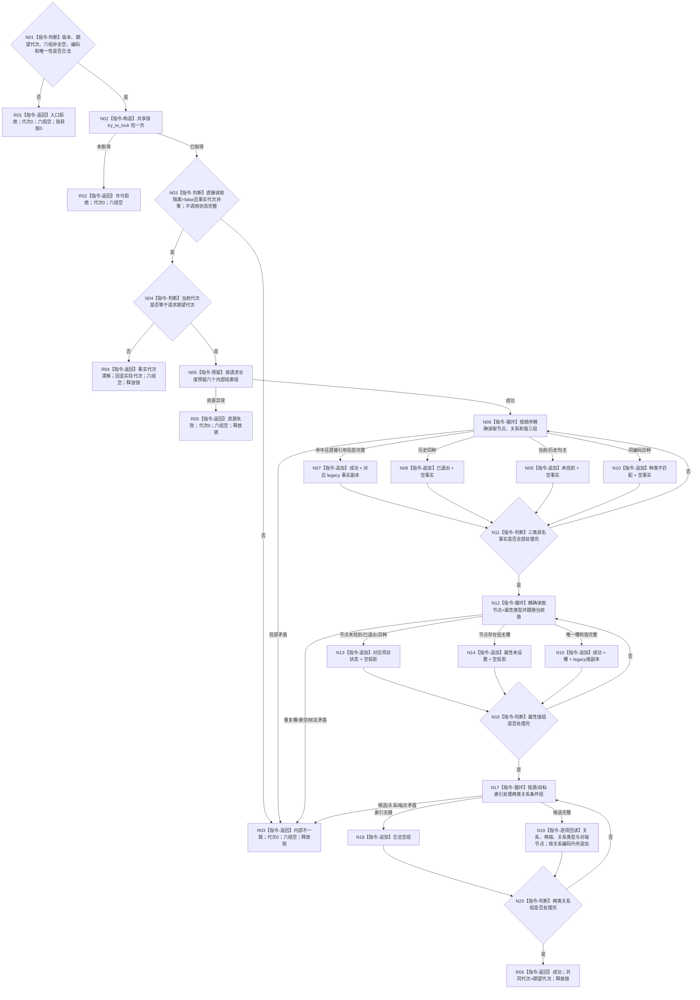

# L1-NEUTRAL-NONBLOCKING-CONSISTENT-PROJECTION
# 尝试读取中性一致当前投影仓库函数流程图 v0.1

更新时间：2026-08-08

## 依据

```text
0050、4015、4030、4050；同名 v0.1 详细设计；
正式代码基线 5df9ff8aeb2fa0fe4b074111074abef3a99c272c
```

## 函数合同

```text
根函数：L1事实基座仓库::尝试读取一致当前内部投影
文件 / 层级：海中鱼巣/核心/仓库.L1事实基座.ixx / L1
现有或待新增：待新增；公开服务同义薄入口在锁外完成唯一中性转换
参数：v1合同、非零期望代次、节点/关系/值/属性值/源关系组/目标关系组六类选择
返回：仓库模块内 legacy 值式内部结果；顶层非成功六组全空
锁：共享 try-lock 恰一次；不等待、不重试、不泄漏
```

## 流程图



## 节点合同

| 节点 | 输入 | 输出 | 事实边界 | 验证重点 |
| --- | --- | --- | --- | --- |
| N01 | 六类选择 | 入口资格 | 零事实访问 | 非零代次、组内唯一、至少一项 |
| N02 | 唯一共享锁 | 取得/拒绝 | 零写 | try-lock 恰一次，无阻塞回退 |
| N03—N04 | 隔离和锁内代次 | 执行资格 | 只读两个字段 | 禁止`状态完整`与快照；漂移回显实际代次 |
| N06—N11 | 已知事实编码 | 三类同序项目 | 精确当前表、单编码历史种类和直接引用 | 节点槽—值—属性类型；关系两端/类型；值所属/来源/类型及材料表示 |
| N12—N16 | 节点+属性类型 | 槽和值副本 | 只读具名节点槽与当前值 | 一次许可内跟随当前值 |
| N17—N20 | 源/目标+关系类型 | 关系与对端节点组 | 索引只供候选，事实回读当前表 | 空组合法但不证明锚点/类型存在；编码升序、两端与类型完整 |
| R01—R05 | 失败原因 | 顶层非成功 | 六组全空、零写 | 除漂移外代次0 |
| R06 | 完整内部项目 | 值式成功 | 共同代次、无锁泄漏 | 后继由服务锁外统一转中性 |

## 关键边界

禁止调用`尝试读取当前事实代次`、`状态完整`、`构造快照`，禁止遍历全仓、永久占用、历史正文、审计、恢复、SQL、材料、索引重建、缓存和写入口。仓库不实现第二套中性转换；公开服务释放锁后复用现有唯一转换器。当前消费者未在本叶运行，构建/静态检查不得升级为业务 PASS 或第一层完善。
