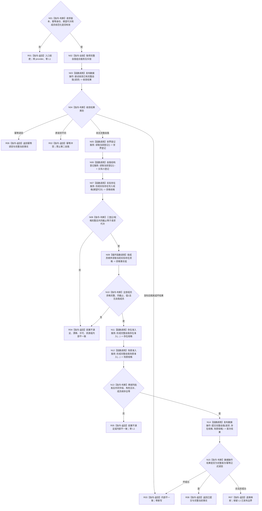
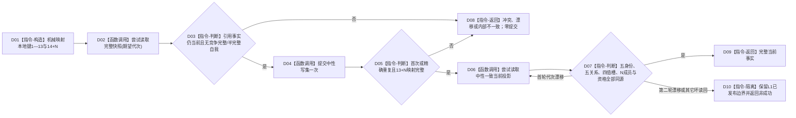

# L2-COMPLETE-SELF-NEUTRAL-PRODUCTION-PUBLISH 发布完整自我函数流程图 v0.1

更新时间：2026-08-08

## 依据与边界

```text
规范/4015_子规范_L1简化事实基座.md
规范/4030_子规范_基础信息服务分层与领域写授权.md
规范/4040_子规范_不透明结构事务候选确认撤销与最后发布.md
规范/7130_子规范_自我内部世界成员特征与事实读取投影.md
规范/8120_子规范_程序入口启动模式与运行宿主边界_20260726.md
规范/详细设计/20260808_L2-COMPLETE-SELF-NEUTRAL-PRODUCTION-PUBLISH_7130完整自我中性单事务生产发布详细设计_v0.1.md
```

本图冻结唯一公开组合根。存在准入与场景准入分别拥有本域语义；组合根只编排并比较共同字段；专用数据操作是唯一 L1 调用点。图中“提交完整自我”内部的快照复核、写集映射、一次提交和正式读回由详细设计第 7 节约束，不把 L1 暴露给组合根。

## 函数合同

```text
根函数：L1完整自我组合服务::发布完整自我
模块：海中鱼巣.领域.组合.L1完整自我
文件：海中鱼巣/领域/组合.L1完整自我.ixx
层级：L2 具名存在场景组合器
签名：完整自我结果 发布完整自我(const 完整自我发布请求& 请求);
参数：const 借用值式请求；含版本、幂等身份、期望事实代次和严格升序出生期成员编码组
返回：调用方拥有的值式结果；仅已提交/幂等读回/已读取携带完整正式事实
事实写入：根函数直接写入 0；只允许数据操作间接执行一次 L1 中性提交
```

## 流程图



## 节点合同

| 节点 | 所有者 | 输入 | 输出 | 读写边界 | 必须验证 |
| --- | --- | --- | --- | --- | --- |
| N01—N04 | 组合服务与数据操作 | 公开请求、保存的首次材料 | 首次/重复/冲突分支 | 同请求可重交原 L1 写集；不同请求零写 | 输入锁前拒绝；原请求全等才精确重复 |
| N05—N07 | 既有领域服务 | 版本和期望代次 | 三项值式登记/规格 | 正式只读 | 三者共同截止且字段完整 |
| N09—N10 | 实际存在领域 | 成员稳定编码 | 严格有序资格事实组 | 正式只读 | 每项 I64=1、同截止、无重复 |
| N11 | 存在准入服务 | 实际存在规格、关系 21 登记 | 本地角色 3/键 8/键 13 规格 | 零 L1、零缓存 | 不解释场景或角色 2 |
| N12 | 场景准入服务 | 世界登记、成员资格、关系 21 登记 | 本地角色 1/2/4、键 5—7、9—12、14+N 规格 | 零 L1、零缓存 | 不解释自我资格或角色 1 |
| N13 | 组合服务 | 两域规格 | 同截止已批准组合 | 零写 | 只比较，不重写规格 |
| N14 | 专用数据操作 | 原请求、两域规格 | L1 发布与正式读回结果 | 唯一 L1 调用点 | `4/4/(5+N)/4/0`、一次提交 |
| N15、R01—R07 | 组合服务 | 结构化结果 | 值式公开结果 | 零额外写 | 坏成功隔离；发布后不撤销 |

## 数据操作子流程摘要



## 关键边界

```text
组合器不直接调用 L1；数据操作不重新解释两域准入。
生产 N=1，但合同保留严格排序的 N 个出生期成员。
旧系统角色初始化只在正式完整自我读回成功后运行，旧清单不是完整自我事实。
本图不证明代码已实现、构建通过、生产接线完成或正式集成验收通过。
```
