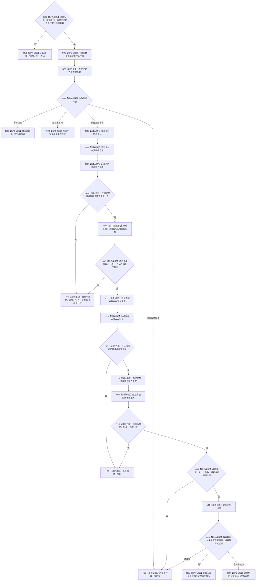
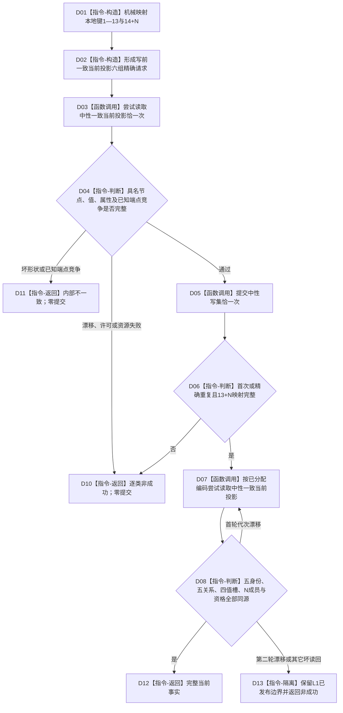

# L2-COMPLETE-SELF-NEUTRAL-PRODUCTION-PUBLISH 发布完整自我函数流程图 v0.2

更新时间：2026-08-08

## 依据与替代关系

```text
规范/4015_子规范_L1简化事实基座.md
规范/4030_子规范_基础信息服务分层与领域写授权.md
规范/4040_子规范_不透明结构事务候选确认撤销与最后发布.md
规范/7130_子规范_自我内部世界成员特征与事实读取投影.md
规范/详细设计/20260808_L2-COMPLETE-SELF-NEUTRAL-PRODUCTION-PUBLISH_7130完整自我中性单事务生产发布详细设计_v0.1.md
规范/详细设计/20260808_L2-COMPLETE-SELF-NEUTRAL-PRODUCTION-PUBLISH_7130完整自我中性单事务生产发布详细设计_v0.2.md
```

本图完整替代同名 v0.1。它保持组合根、两域分责、一次中性提交和发布后正式读回不变；唯一流程修订是把数据操作写前旧全量诊断读取替换为按已知稳定编码和必要关系索引形成的一次中性一致当前投影。该投影只证明已知引用与已知端点，不证明任意未知候选都不存在。

## 函数合同

```text
根函数：L1完整自我组合服务::发布完整自我
模块：海中鱼巣.领域.组合.L1完整自我
文件：海中鱼巣/领域/组合.L1完整自我.ixx
层级：L2具名存在场景组合器
签名：完整自我结果 发布完整自我(const 完整自我发布请求& 请求);
参数：版本、幂等身份、期望事实代次和严格升序出生期成员编码组
返回：调用方拥有的值式结果；仅已提交、幂等读回、已读取携带完整正式事实
事实写入：根函数直接写入0；数据操作间接调用一次L1中性提交
```

## 流程图



## 准入节点合同

| 节点 | 输入 | 输出 | 事实边界 | 必须验证 |
| --- | --- | --- | --- | --- |
| N11—N13 | 世界登记、实际存在规格、自我结构登记、共同截止 | 存在准入请求、结果、规格 | 零L1、零分配、零缓存 | 只批准角色3/4、键3/4/8/13、关系21角色1 |
| N14—N16 | 同一三项来源、成员资格组、共同截止 | 场景准入请求、结果、规格 | 零L1、只复制值式成员组 | 只批准三场景、键1—7/9—12/14起、关系21角色2 |
| N17 | 两域完整规格 | 可提交组合 | 零写 | 逐字段比较，不修正、不排序、不补项 |

## 数据操作子流程



## 写前六组精确合同

| 组 | 输入 | 判定 |
| --- | --- | --- |
| 节点 | 世界根、三服务、五类型、全部成员 | 全部当前且类型精确 |
| 关系 | 空 | 新关系编码只能由本次提交分配 |
| 值 | 全部成员资格值编码 | 与成员资格见证全等 |
| 属性值 | 世界根场景标记、全部成员资格 | 当前值为1且来源/类型精确 |
| 源关系组 | 世界根和每个成员对自我结构关系类型 | 全部为空 |
| 目标关系组 | 世界根和每个成员对自我结构关系类型 | 全部为空 |

六组只访问已知稳定编码和必要索引。源/目标空组只排除已知世界根与成员成为关系21端点；未知新节点没有稳定编码，不能写前查询。当前首跑的未知全局候选由空构造、无恢复导入、无其它合法关系21写者和唯一数据操作发布者四项门禁排除。

## 关键边界

```text
组合服务不直接调用L1；数据操作不重新解释两域准入。
生产N=1，但合同保留严格排序的N个出生期成员。
普通生产路径不调用旧全量诊断读取、审计、恢复或全局遍历。
任一首跑门禁改变时停止适用，不能沿用本图推断全局唯一。
旧系统角色只在正式完整自我读回成功后运行。
本图不证明代码已实现、构建通过、正式集成验收通过或L1完善。
```
