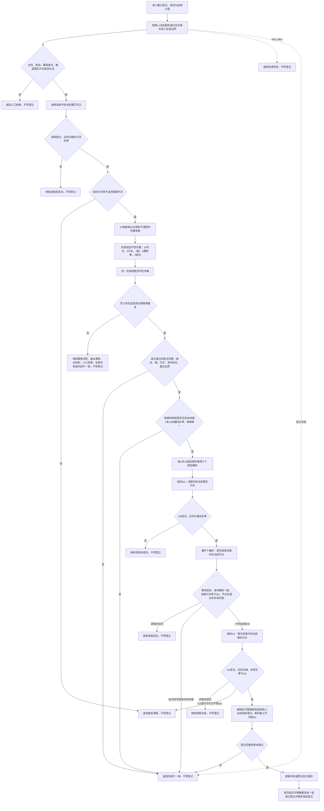

# L2-DYNAMIC-REGISTRY-NEUTRAL-WRITE-MIGRATION 建立登记函数流程图 v0.1

日期：2026-08-08

根函数：`L1动态服务::建立登记(const L1动态登记请求&)`

边界：只画这一根函数及其直接调用的私有校验 / 读回步骤；不画 `读取当前登记`、状态迁移动能规格、其它状态动态逻辑或 L1 内部事务实现。图是目标设计，不是当前代码事实。

## 固定数据形状

| 本地键 | 节点形状 |
| --- | --- |
| 1 | 普通节点：服务身份 |
| 2 | 普通节点：关系20动态组成关系类型 |
| 3—5 | 属性类型节点：I64 |
| 6—7 | 属性类型节点：U64组 |
| 8 | 属性类型节点：I64 |
| 9 | 属性类型节点：U64组 |
| 10 | 属性类型节点：I64组 |

业务操作标签、意图组、入口变体、领域意图凭证、旧幂等探测、完整快照和首次请求缓存不进入本流程。
