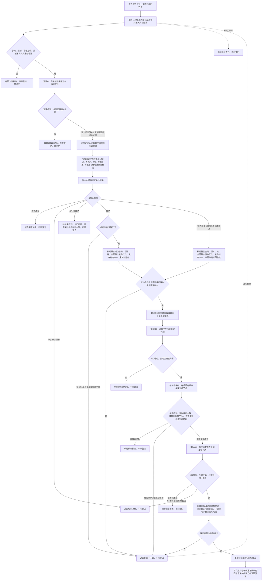

# L2-DYNAMIC-REGISTRY-NEUTRAL-WRITE-MIGRATION 建立登记函数流程图 v0.2

日期：2026-08-08

根函数：`L1动态服务::建立登记(const L1动态登记请求&)`

边界：只画这一根函数及其直接调用的私有校验 / 读回步骤；不画 `读取当前登记`、状态迁移动能规格、其它状态动态逻辑或 L1 内部事务实现。图是目标设计，不是当前代码事实。v0.2 的关键裁决是提交前代次预读只做入口健康和首次成功诊断，不提前阻断精确重复到达 L1。



## 顺序与数据形状

```text
领域预读 P
-> 不提前比较 P 与请求期望并返回
-> 恰一次提交完整原请求
-> L1：精确重复 -> 同键异义 -> 期望代次漂移 -> 首次候选发布
-> 成功类按首次十编码读取当前 G0 / G1
```

固定节点形状：1—2 为普通节点；3—5 为 I64 属性类型；6—7 为 U64组属性类型；8 为 I64 属性类型；9 为 U64组属性类型；10 为 I64组属性类型。业务操作标签、意图组、入口变体、领域意图凭证、旧幂等探测、完整快照和首次请求缓存不进入本流程。
