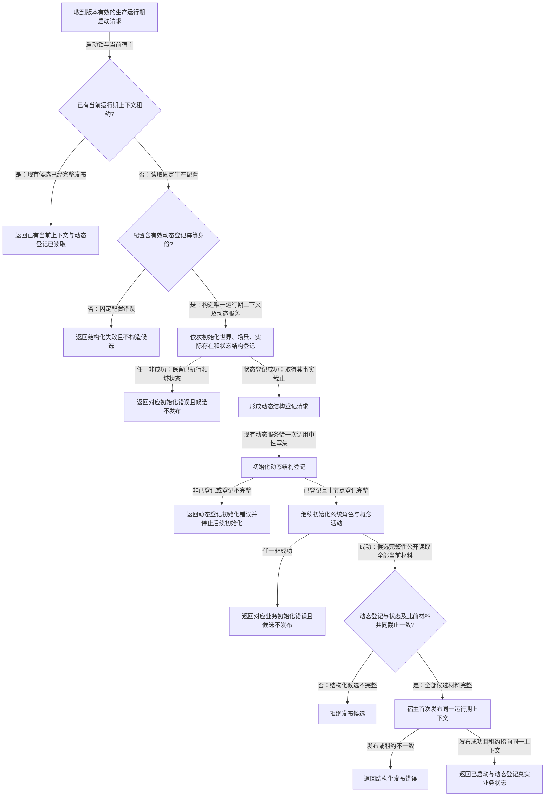

# 生产运行期初始化动态结构登记函数流程图 v0.1

日期：2026-08-08

状态：目标函数流程设计；不表示代码已经实现或运行。

目标函数：`生产运行期会话::启动`

```mermaid
flowchart TD
    A["收到版本有效的生产运行期启动请求"] -->|"启动锁与当前宿主"| B{"已有当前运行期上下文租约?"}
    B -->|"是：现有候选已经完整发布"| C["返回已有当前上下文与动态登记已读取"]
    B -->|"否：读取固定生产配置"| D{"配置含有效动态登记幂等身份?"}
    D -->|"否：固定配置错误"| E["返回结构化失败且不构造候选"]
    D -->|"是：构造唯一运行期上下文及动态服务"| F["依次初始化世界、场景、实际存在和状态结构登记"]
    F -->|"任一非成功：保留已执行领域状态"| G["返回对应初始化错误且候选不发布"]
    F -->|"状态登记成功：取得其事实截止"| H["形成动态结构登记请求"]
    H -->|"现有动态服务恰一次调用中性写集"| I["初始化动态结构登记"]
    I -->|"非已登记或登记不完整"| J["返回动态登记初始化错误并停止后续初始化"]
    I -->|"已登记且十节点登记完整"| K["继续初始化系统角色与概念活动"]
    K -->|"任一非成功"| L["返回对应业务初始化错误且候选不发布"]
    K -->|"成功：候选完整性公开读取全部当前材料"| M{"动态登记与状态及此前材料共同截止一致?"}
    M -->|"否：结构化候选不完整"| N["拒绝发布候选"]
    M -->|"是：全部候选材料完整"| O["宿主首次发布同一运行期上下文"]
    O -->|"发布或租约不一致"| P["返回结构化发布错误"]
    O -->|"发布成功且租约指向同一上下文"| Q["返回已启动与动态登记真实业务状态"]
```

边界：本流程只增加第二层动态结构登记的真实生产初始化。它不运行第一层测试，不创建状态、动态或因果事实，也不以日志或退出码替代结构化状态和权威读回。
