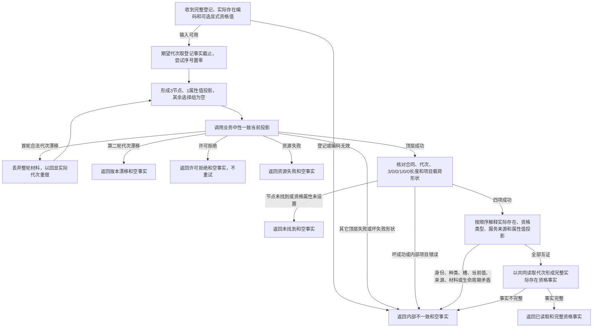

# 读取实际存在资格函数流程图 v0.1

日期：2026-08-08

适用函数：`L1实际存在服务::读取资格实现`

```mermaid
flowchart TD
    A["收到完整登记、实际存在编码和可选显式资格值"] -->|"登记或编码无效"| Z1["返回内部不一致和空事实"]
    A -->|"输入可用"| B["期望代次取登记事实截止，尝试序号置零"]
    B --> C["形成3节点、1属性值投影，其余选择组为空"]
    C --> D["调用业务中性一致当前投影"]
    D -->|"首轮合法代次漂移"| E["丢弃整轮材料，以回显实际代次重做"]
    E --> C
    D -->|"第二轮代次漂移"| Z2["返回版本漂移和空事实"]
    D -->|"许可拒绝"| Z3["返回许可拒绝和空事实，不重试"]
    D -->|"资源失败"| Z4["返回资源失败和空事实"]
    D -->|"其它顶层失败或坏失败形状"| Z1
    D -->|"顶层成功"| F["核对合同、代次、3/0/0/1/0/0长度和项目载荷形状"]
    F -->|"坏成功或内部项目错误"| Z1
    F -->|"节点未找到或资格属性未设置"| Z5["返回未找到和空事实"]
    F -->|"四项成功"| G["按顺序解释实际存在、资格类型、服务来源和属性值投影"]
    G -->|"身份、种类、槽、当前值、来源、材料或生命周期矛盾"| Z1
    G -->|"全部互证"| H["以共同读取代次形成完整实际存在资格事实"]
    H -->|"事实完整"| Z6["返回已读取和完整资格事实"]
    H -->|"事实不完整"| Z1
```

边界：本函数不写事实、不解释第一层之外的资格来源、不等待许可、不进行第三次读取，不返回任何部分事实。后续验收只通过真实第二层消费者进入本函数。
