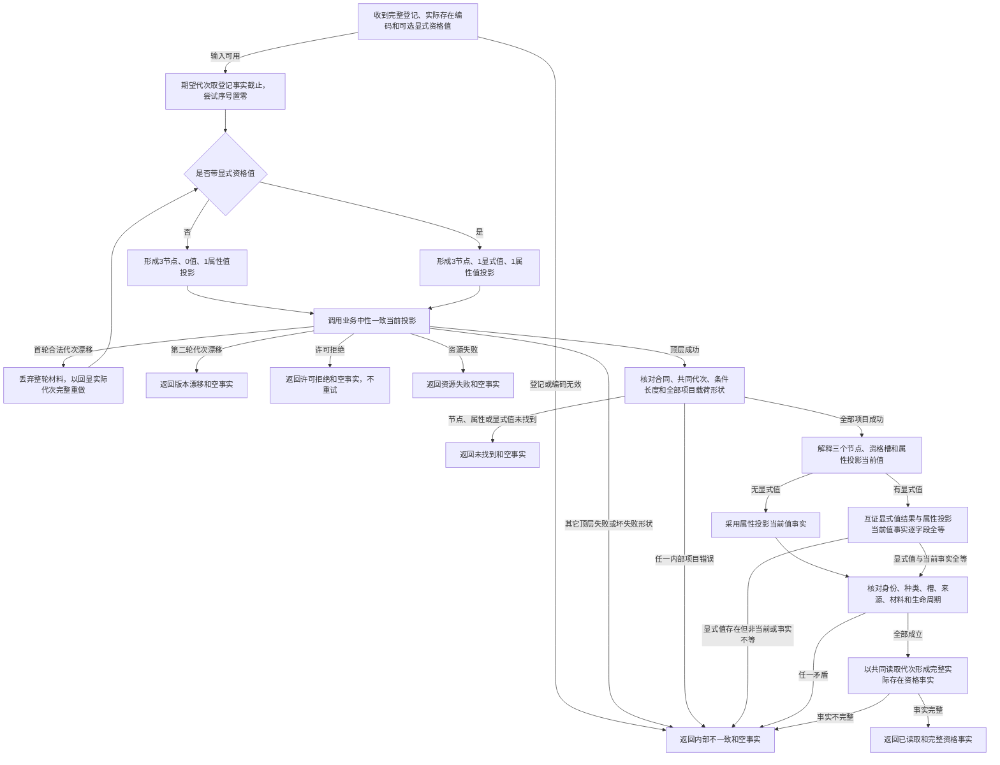

# 读取实际存在资格函数流程图 v0.2

日期：2026-08-08

适用函数：`L1实际存在服务::读取资格实现`

```mermaid
flowchart TD
    A["收到完整登记、实际存在编码和可选显式资格值"] -->|"登记或编码无效"| Z1["返回内部不一致和空事实"]
    A -->|"输入可用"| B["期望代次取登记事实截止，尝试序号置零"]
    B --> C{"是否带显式资格值"}
    C -->|"否"| D1["形成3节点、0值、1属性值投影"]
    C -->|"是"| D2["形成3节点、1显式值、1属性值投影"]
    D1 --> E["调用业务中性一致当前投影"]
    D2 --> E
    E -->|"首轮合法代次漂移"| F["丢弃整轮材料，以回显实际代次完整重做"]
    F --> C
    E -->|"第二轮代次漂移"| Z2["返回版本漂移和空事实"]
    E -->|"许可拒绝"| Z3["返回许可拒绝和空事实，不重试"]
    E -->|"资源失败"| Z4["返回资源失败和空事实"]
    E -->|"其它顶层失败或坏失败形状"| Z1
    E -->|"顶层成功"| G["核对合同、共同代次、条件长度和全部项目载荷形状"]
    G -->|"任一内部项目错误"| Z1
    G -->|"节点、属性或显式值未找到"| Z5["返回未找到和空事实"]
    G -->|"全部项目成功"| H["解释三个节点、资格槽和属性投影当前值"]
    H -->|"无显式值"| I1["采用属性投影当前值事实"]
    H -->|"有显式值"| I2["互证显式值结果与属性投影当前值事实逐字段全等"]
    I1 --> J["核对身份、种类、槽、来源、材料和生命周期"]
    I2 -->|"显式值存在但非当前或事实不等"| Z1
    I2 -->|"显式值与当前事实全等"| J
    J -->|"任一矛盾"| Z1
    J -->|"全部成立"| K["以共同读取代次形成完整实际存在资格事实"]
    K -->|"事实完整"| Z6["返回已读取和完整资格事实"]
    K -->|"事实不完整"| Z1
```

边界：本函数不写事实，不等待许可，不做第三次读取或局部补读。无显式值时不重复请求独立值；有显式值时独立值只为保留现行公开定位语义。后续只能由真实第二层服务使用该函数，不建立第一层自证流程。
