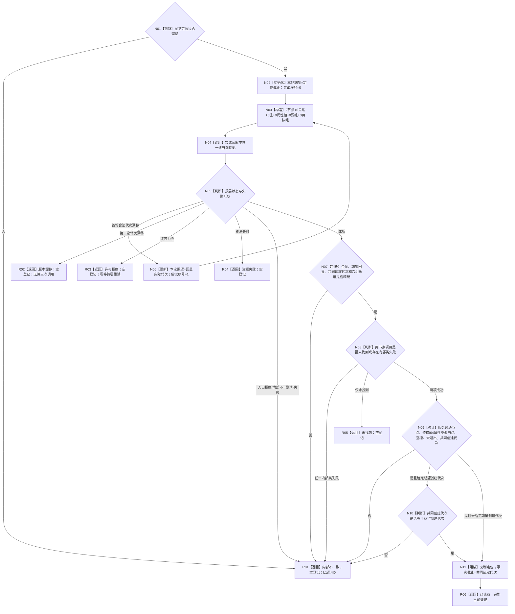
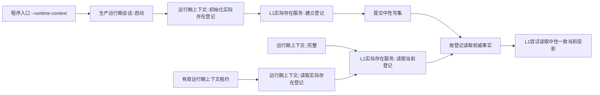

# L2-EXISTENCE-REGISTRY-CURRENT-READ-CONSISTENT-PROJECTION-MIGRATION
# 按登记读取权威事实函数流程图 v0.1

日期：2026-08-08

对应详细设计：`规范/详细设计/20260808_L2-EXISTENCE-REGISTRY-CURRENT-READ-CONSISTENT-PROJECTION-MIGRATION_实际存在登记当前读回一致投影迁移详细设计_v0.1.md`

实现基线：`4ba783408607c2e73b468d2c00236547610365cc`

目标函数：`L1实际存在服务::按登记读取权威事实(const 实际存在结构登记&, std::optional<std::uint64_t>) const`

物理位置：`海中鱼巣/领域/服务.L1实际存在.ixx`

偏差身份：`L2-EXISTENCE-REGISTRY-READ-D01`

## 1. 目标函数流程



## 2. 节点合同

| 节点 | 输入 | 输出 | 事实 / 许可边界 | 验证重点 |
| --- | --- | --- | --- | --- |
| N01 | 登记定位 | 入口资格 | 零 L1 调用 | 合同、规则、幂等身份、截止、两编码完整且互异 |
| N02—N03 | 定位截止、两编码 | 中性一致请求 | 零事实访问 | `2/0/0/0/0/0`；首轮只取定位截止 |
| N04 | 完整请求 | 中性一致结果 | 每轮共享 try-lock 一次 | 物理调用点恰一；最多两个完整轮次 |
| N05—N06 | 顶层状态、回显代次 | 成功材料或第二轮请求 | 不保留首轮材料 | 只对合法首轮漂移重试；许可拒绝不重试 |
| N07 | 顶层成功 | 两节点项目 | 单一共同截止 | 合同、期望回显、读取代次、六组长度 |
| N08 | 两项目状态 | 未找到 / 可继续 / 内部错误 | 不补读 | 内部类错误优先于未找到 |
| N09—N10 | 两节点事实、可选创建代次 | 业务登记形状 | 值式副本 | 普通服务、I64属性类型、空槽、未退出、共同创建代次 |
| N11 | 定位、共同读取代次 | 现有登记 DTO | 零写 | 只更新返回副本的事实截止 |
| R01—R05 | 结构化非成功 | 空登记 | 零写 | 不修改定位缓存、不返回部分登记 |
| R06 | 完整当前登记 | 已读取 | 调用方拥有值式登记 | 只证明本消费者实际当前读 |

## 3. 固定请求与重试形状

```text
首轮期望事实代次：定位.事实截止代次
节点：定位.服务身份，定位.实际存在资格属性类型
关系：空
值：空
属性值：空
源关系组：空
目标关系组：空
```

只有首轮合法事实代次漂移可以把回显实际代次用于第二轮完整请求。第二轮仍漂移直接返回版本漂移；许可拒绝、资源失败、入口拒绝、内部不一致或坏失败形状都不得重试。禁止旧事实代次 / 节点分散调用、完整快照、关系组、历史、审计、恢复、SQL、索引、缓存和写入口。

## 4. 正式生产调用边



## 5. 完成边界

本图是目标施工流程，不是当前实现事实。施工后必须按实际代码更新现状图谱；流程图、计划、构建或生产退出码不单独证明结构化实际存在登记业务成功。
