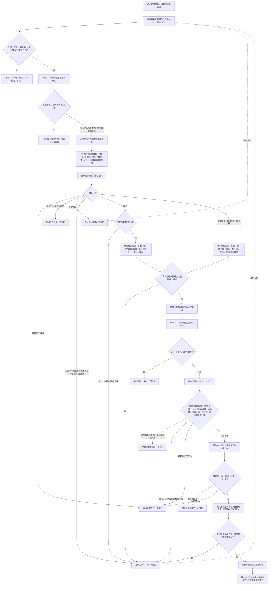

# L2-FEATURE-COMPARISON-REGISTRY-NEUTRAL-WRITE-MIGRATION 建立登记函数流程图 v0.1

日期：2026-08-08

根函数：`特征比较服务::建立登记(const 特征比较登记请求&)`

边界：只画 M01 根函数及其直接调用的私有校验、映射和权威读回；不画 `读取当前登记()`、M02 `0x15000802U`、M03 `0x15000803U`、运行期比较、状态动态联合发布或 L1 内部事务。图是目标施工事实，不是当前实现事实。



## 固定节点映射与顺序

```text
键1 服务身份                 普通
键2 合同配置I64组属性类型     属性类型 / I64组
键3 合同字段关系类型          普通
键4 无单位                    普通
键5 标量维度                  普通
键6 标量分量角色              普通
```

```text
领域预读 P
-> 不提前用 P 裁决请求漂移
-> 恰一次提交完整原请求
-> L1：精确重复 -> 同键异义 -> legacy 键占用 -> 期望代次漂移 -> 首次候选发布
-> 成功类按首次六编码执行 G0 + 六节点 + G1 当前读回
```

业务标签 `0x15000801U`、G8 登记意图、旧幂等预探测、完整快照和首次请求缓存不进入目标流程。流程图不授权修改 M02/M03 或运行比较。
