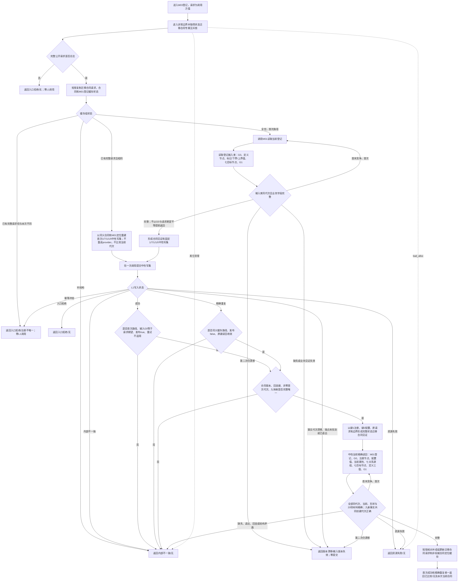

# L2-FEATURE-COMPARISON-STATE-TRANSITION-CONTRACT-NEUTRAL-CRUD-MIGRATION 登记 I64 状态迁移比较合同函数流程图 v0.1

日期：2026-08-08

根函数：`特征比较服务::登记I64状态迁移比较合同(const I64状态迁移比较合同登记请求&)`

边界：只画 M03 根函数及其直接调用的登记输入读取、固定写集形成和中性精确读回；不画 M01、M02、公开当前读取、三个运行比较、状态动态联合发布或 L1 内部事务。图是目标施工事实，不是当前实现事实。



## 固定写集

```text
节点 1：状态迁移比较注册
值 2：注册节点的 I64组配置，固定20项
关系 3—9：注册 -> 七目标，合同字段关系类型，角色1—7
属性槽：注册.合同配置I64组属性类型 -> 值2
退出：0
```

```text
领域缓存只裁决完整业务请求同义 / 异义
-> L1 只比较完整中性物理写集
-> 成功类必须回到 M03 当前合同精确读回
-> 本 L2 合同闭合不等于第一层自证或完善
```

`0x15000803U`、G8、旧探测、完整快照和 legacy 提交不进入目标登记流程；M01、M02、三个运行比较与状态动态联合发布保持不变。
