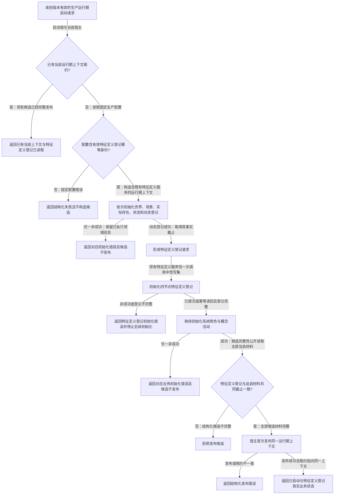

# 生产运行期初始化特征定义登记函数流程图 v0.1

日期：2026-08-08

状态：目标函数流程设计；不表示代码已经实现或运行。

目标函数：`生产运行期会话::启动`

```mermaid
flowchart TD
    A["收到版本有效的生产运行期启动请求"] -->|"启动锁与当前宿主"| B{"已有当前运行期上下文租约?"}
    B -->|"是：现有候选已经完整发布"| C["返回已有当前上下文与特征定义登记已读取"]
    B -->|"否：读取固定生产配置"| D{"配置含有效特征定义登记幂等身份?"}
    D -->|"否：固定配置错误"| E["返回结构化失败且不构造候选"]
    D -->|"是：构造含既有特征定义服务的运行期上下文"| F["依次初始化世界、场景、实际存在、状态和动态登记"]
    F -->|"任一非成功：保留已执行领域状态"| G["返回对应初始化错误且候选不发布"]
    F -->|"动态登记成功：取得其事实截止"| H["形成特征定义登记请求"]
    H -->|"现有特征定义服务恰一次调用中性写集"| I["初始化四节点特征定义登记"]
    I -->|"非成功或登记不完整"| J["返回特征定义登记初始化错误并停止后续初始化"]
    I -->|"已提交或幂等读回且登记完整"| K["继续初始化系统角色与概念活动"]
    K -->|"任一非成功"| L["返回对应业务初始化错误且候选不发布"]
    K -->|"成功：候选完整性公开读取全部当前材料"| M{"特征定义登记与此前材料共同截止一致?"}
    M -->|"否：结构化候选不完整"| N["拒绝发布候选"]
    M -->|"是：全部候选材料完整"| O["宿主首次发布同一运行期上下文"]
    O -->|"发布或租约不一致"| P["返回结构化发布错误"]
    O -->|"发布成功且租约指向同一上下文"| Q["返回已启动与特征定义登记真实业务状态"]
```

边界：本流程只初始化特征定义服务自己的结构登记，不创建任何具体特征定义、实例特征或状态，也不运行第一层测试。
