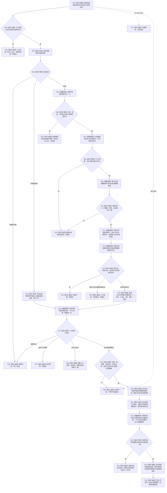

# L2-FIRST-BASELINE-STATE-NEUTRAL-CRUD-MIGRATION 发布实际存在 I64 首个基准状态函数流程图 v0.1

更新时间：2026-08-08

## 依据

```text
现行正式规范：0050、4015 v0.6、4030 v1.4、4040 v1.4、4050 v1.2、1160、4190、4200、4210
配套详细设计：20260808_L2-FIRST-BASELINE-STATE-NEUTRAL-CRUD-MIGRATION_实际存在I64首个基准状态中性CRUD迁移详细设计_v0.1.md
当前代码基线：main/origin/main badc54ee944b11994e2541c36c1a7537f24be4f7
当前目标代码 blob：服务.L1状态.ixx=c756d4f95ba32bc88436846bcb0070bb7e8ee2c8
```

## 身份与边界

本图是后续代码实施的正式目标单根函数图，不是当前实现事实，也不证明代码、构建、真实消费者、生产接线或集成验收已经完成。

只画 `发布实际存在I64首个基准状态` 及其直接业务步骤。私有相关状态查询和 `读取实际存在I64基准状态` 的中性当前 / 历史 G0—G1 合同由配套详细设计第 6、8 节冻结，本图只作为具名调用节点引用；不另建 HTML 或第二张函数图。

明确不画：已完成状态登记、相邻前状态、后继状态、第二状态、状态动态原子发布、特征比较、动态、因果和 L1 内部事务实现。

## 函数合同

```text
根函数：L1状态服务::发布实际存在I64首个基准状态
归属模块 / 文件 / 层级：海中鱼巣.领域.服务.L1状态 / 海中鱼巣/领域/服务.L1状态.ixx / L2 状态领域
现有或待新增：现有公开函数，待迁移内部实现
完整签名：实际存在I64基准状态结果 发布实际存在I64首个基准状态(const 实际存在I64首个基准状态发布请求& 请求)
参数：请求；const 引用输入；公开业务语义含合同、规则、幂等身份、期望代次、P7/P8 当前特征读取请求和发生时间
返回：实际存在I64基准状态结果；成功类为已提交或幂等读回并携带完整事实；非成功不携带事实
```

## 流程图



## 节点合同

| 节点 | 类型 | 输入 / 绑定 | 结果 | 事实读写 | 关键验证 |
| --- | --- | --- | --- | --- | --- |
| N01—N04 | 本函数内指令 | 公开请求、登记、`首态账_` | 首次 / 同义 / 异义 | 只读业务账 | 同键逐字段请求语义 |
| N05—N06 | 中性函数调用 + 判断 | 中性合同、请求期望代次 | 首次共同 G | 只读事实代次 | 新键旧代次在业务读取前拒绝 |
| N07—N10 | P7 / P8 与中性值读取 | 当前特征请求、G | 同代业务材料 | 只读 P7 / P8 / 当前值 | 宿主、槽、值、来源、I64、同代 |
| N11—N13 | 中性条件与精确读取 | 主体、实例槽、关系19类型、G | 无首态 / 已有 / 矛盾 | 只读必要索引和相关事实 | 目标组角色1/3交集；源组角色1—5；普通节点 |
| N14—N16 | 构造 + 中性提交 | 首次材料或账内原写集 | L1 中性写入结果 | N16 是唯一可能发布点 | `2/5/5/5/0`；0x0D；物理提交恰一 |
| N17—N20 | 本函数内裁决 | 写入结果、12映射、业务账 | 读取定位 | 首次只写非权威 L2 账 | 成功 / 重复发布标志与重试边界；重复定位一致 |
| N21 | 函数调用 | 12 编码读取请求 | 完整不可变首态 | G0 + 具名中性当前 / 历史 + 源关系组 + G1 | 配套详细设计 §8 |
| N22—N23 | 本函数内指令 | 当前读回、首次账 | 业务成功结果 | 首次固定业务结果；不写 L1 | 不缓存直返；身份一致 |
| R01—R12 | 返回 | 对应结构化状态 | 无事实或完整事实 | 不新增发布；已发布后失败不回滚 | 非成功无部分事实 |

## 关键边界

```text
L2首态账裁决公开业务请求同义/异义；L1只裁决完整中性写集同义/异义。
同义重复复用首次写集并再次到达L1，不重读后来变化的P7/P8，也不缓存直返。
两个目标关系查询和相关源关系查询替代完整快照与全仓状态扫描。
首态发布不调用比较，不生成关系20、动态或因果。
发布后读回失败保留事实与定位，不补写、不换键、不伪装未发布。
```
