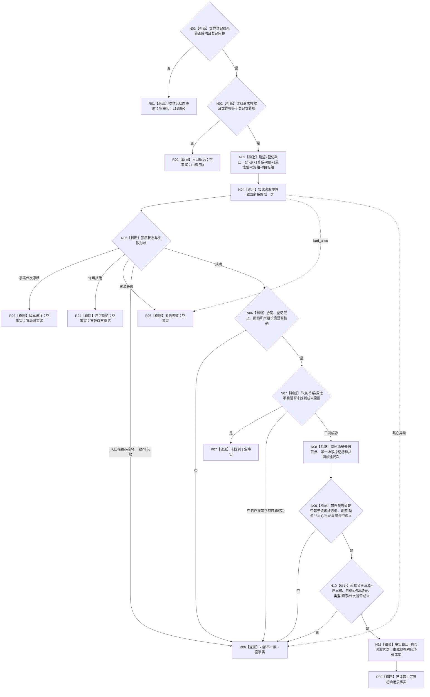
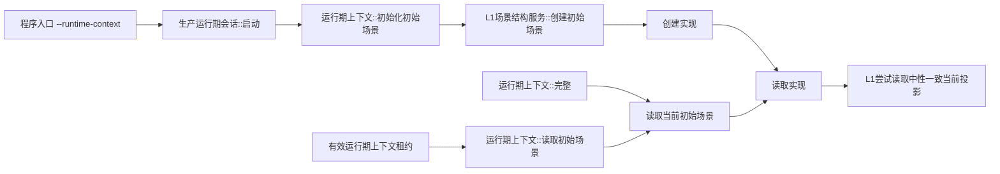

# L2-INITIAL-SCENE-CURRENT-READ-CONSISTENT-PROJECTION-MIGRATION
# 读取实现函数流程图 v0.1

日期：2026-08-08

对应详细设计：`规范/详细设计/20260808_L2-INITIAL-SCENE-CURRENT-READ-CONSISTENT-PROJECTION-MIGRATION_初始场景当前读回一致投影迁移详细设计_v0.1.md`

实现基线：`e0b1d40bc3fadb53944157cb7cee02e9cbc48b53`

目标函数：`L1场景结构内部::读取实现(const L1事实基座服务&, const 世界登记结果&, const 初始场景读取请求&)`

物理位置：`海中鱼巣/领域/服务.L1场景结构.ixx`

偏差身份：`L2-INITIAL-SCENE-READ-D01`

## 1. 目标函数流程



## 2. 节点合同

| 节点 | 输入 | 输出 | 事实 / 许可边界 | 验证重点 |
| --- | --- | --- | --- | --- |
| N01—N02 | 登记结果、读取请求 | 业务入口资格 | 零 L1 调用 | 登记成功、请求有效、世界根一致 |
| N03 | 登记截止、三个定位编码 | 中性一致请求 | 零事实访问 | `1/1/0/1/0/0`；标记值不进入值组 |
| N04 | 完整请求 | 中性一致结果 | 共享 try-lock 恰一次 | 不取得仓、许可、内部句柄，不局部重试 |
| N05—N06 | 顶层状态、合同和代次 | 可解释投影 | 单一共同截止 | 漂移直接返回；许可拒绝不等待 |
| N07 | 三项目状态 | 未找到 / 可继续 / 内部错误 | 不补读 | 未找到/属性未设置与已退出/异种分账 |
| N08 | 节点事实 | 初始场景形状 | 值式副本 | 普通、未退出、唯一标记槽、创建代次 |
| N09 | 属性槽 + 当前值 | 场景标记见证 | 同一许可 | 请求值编码、所属、类型、来源、I64(1) |
| N10 | 直接父关系事实 | 父关系见证 | 同一许可 | 世界根到初始场景、登记类型、顺序0 |
| N11 | 三类完整事实 | 现有业务 DTO | 零写 | 共同创建代次、截止、完整字段 |
| R01—R07 | 结构化非成功 | 空事实 | 零写 | 不返回部分场景、不修改定位缓存 |
| R08 | 完整业务事实 | 已读取 | 调用方拥有值式事实 | 只证明本消费者实际当前读 |

## 3. 固定请求形状

```text
期望事实代次：世界登记本次已验证事实代次
节点：初始场景
关系：直接父关系
值：空
属性值：(初始场景, 世界登记.场景标记属性类型)
源关系组：空
目标关系组：空
```

禁止把顶层漂移回显代次直接用于局部重试；必须由公开场景服务的下一完整调用重新读取世界登记。禁止旧事实代次 / 节点 / 属性 / 值 / 关系分散调用、完整快照、关系组、历史、审计、恢复、SQL、索引、缓存和写入口。

## 4. 正式生产调用边



## 5. 完成边界

本图是目标施工流程，不是当前实现事实。施工后必须按实际代码更新现状图谱；流程图、计划、构建或生产退出码不单独证明结构化场景业务成功。
