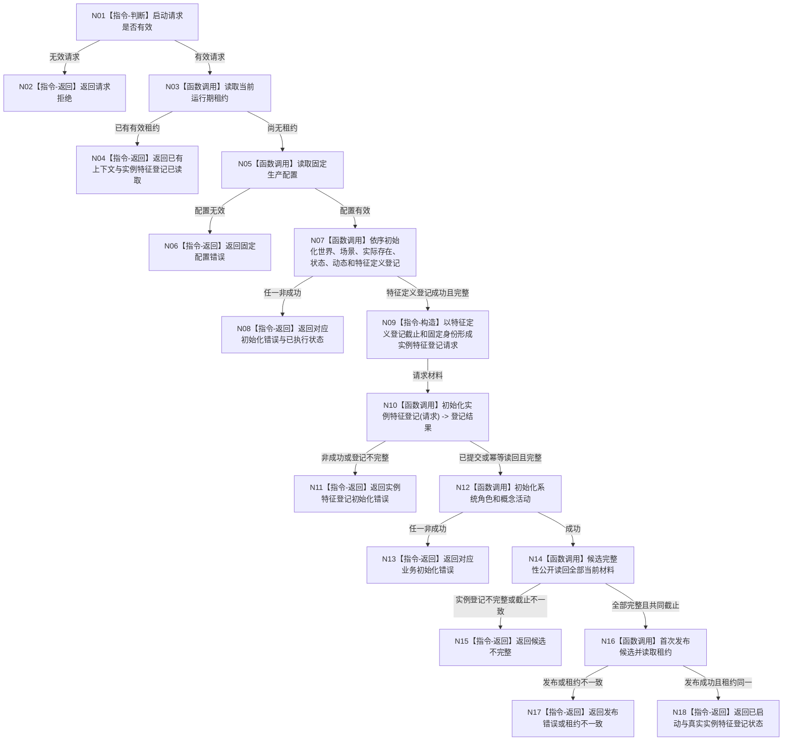

# 生产运行期初始化实例特征登记函数流程图 v0.1

日期：2026-08-08

状态：目标函数流程设计；不表示代码已经实现或运行。

根函数：`生产运行期启动结果 生产运行期会话::启动(const 生产运行期启动请求& 请求)`

输入：版本化生产启动请求；固定生产配置由函数内部读取。

返回：结构化生产运行期启动结果，含各已执行领域状态、发布状态和可选有效租约。

关键边界：本函数只初始化实例特征服务自己的四节点结构登记，不创建具体特征定义、实例槽、实例值或状态，不运行第一层测试，也不通过日志判定通过。
