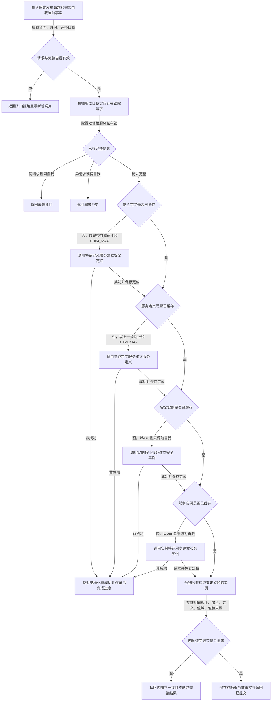

# 发布并读回自我双轴根函数流程图 v0.1

```mermaid
flowchart TD
    A["输入固定发布请求和完整自我当前事实"] -->|"校验合同、身份、完整自我"| B{"请求与完整自我有效"}
    B -->|"否"| X1["返回入口拒绝且零新增调用"]
    B -->|"是"| C["机械形成自我实际存在读取请求"]
    C -->|"取得双轴根服务私有锁"| D{"已有完整结果"}
    D -->|"同请求且同自我"| X2["返回幂等读回"]
    D -->|"异请求或异自我"| X3["返回幂等冲突"]
    D -->|"尚未完整"| E{"安全定义是否已缓存"}
    E -->|"否，以完整自我截止和0..I64_MAX"| F["调用特征定义服务建立安全定义"]
    F -->|"非成功"| X4["映射结构化非成功并保留已完成进度"]
    F -->|"成功并保存定位"| G{"服务定义是否已缓存"}
    E -->|"是"| G
    G -->|"否，以上一步截止和0..I64_MAX"| H["调用特征定义服务建立服务定义"]
    H -->|"非成功"| X4
    H -->|"成功并保存定位"| I{"安全实例是否已缓存"}
    G -->|"是"| I
    I -->|"否，以A=1且来源为自我"| J["调用实例特征服务建立安全实例"]
    J -->|"非成功"| X4
    J -->|"成功并保存定位"| K{"服务实例是否已缓存"}
    I -->|"是"| K
    K -->|"否，以V=0且来源为自我"| L["调用实例特征服务建立服务实例"]
    L -->|"非成功"| X4
    L -->|"成功并保存定位"| M["分别公开读取双定义和双实例"]
    K -->|"是"| M
    M -->|"互证共同截止、宿主、定义、值域、值和来源"| N{"四项逐字段完整且全等"}
    N -->|"否"| X5["返回内部不一致且不形成完整结果"]
    N -->|"是"| O["保存双轴根当前事实并返回已提交"]
```

边界：本函数只编排现有特征定义和实例特征服务，不直接调用第一层，不读取或修改旧系统角色根组，不创建根需求、状态、动态或因果。
