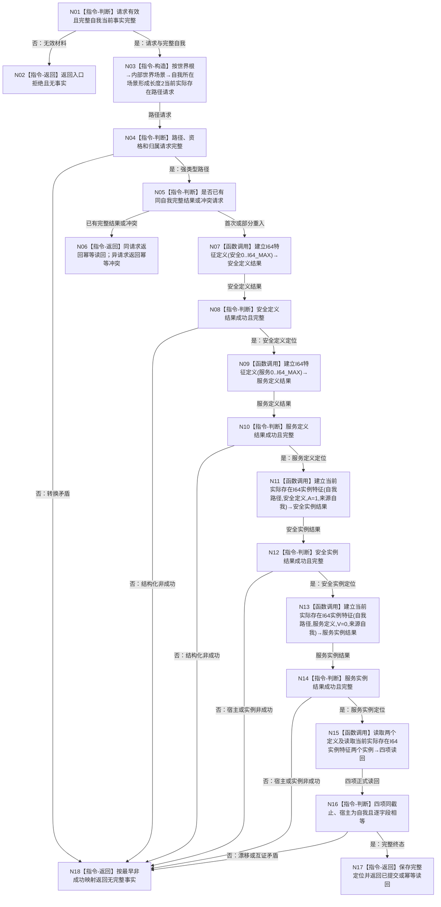

# 发布并读回自我双轴根函数流程图 v0.2

更新时间：2026-08-08

## 依据

```text
规范/4015_子规范_L1简化事实基座.md
规范/4030_子规范_基础信息服务分层与领域写授权.md
规范/详细设计/20260808_L2-SELF-ROOT-NEUTRAL-PRODUCTION-PUBLISH_6130双轴根定义与实例中性生产发布详细设计_v0.2.md
当前代码：实际存在读取请求仍为初始场景专用；独立当前实际存在提供者尚未实现
```

## 身份与边界

本图是来源计划原目标内的正式目标单函数图，替代 v0.1。它冻结根服务在独立提供者已经真实实现后的消费顺序；图中的新强类型实例入口是待实现依赖，不是当前能力。

## 函数合同

```text
根函数：L1自我双轴根服务::发布自我双轴根
归属模块 / 文件 / 层级：海中鱼巣.领域.服务.L1自我双轴根 / 海中鱼巣/领域/服务.L1自我双轴根.ixx / 第二层
现有或待新增：根函数 WIP 已存在；v0.2 需在提供者结果后修订
完整签名：自我双轴根结果 发布自我双轴根(const 自我双轴根发布请求& 请求, const 完整自我当前事实& 完整自我)
参数：请求和完整自我均为调用期只读值；调用方保持生命周期覆盖本次调用
返回结果：已提交、幂等读回、前置不满足、入口拒绝、幂等冲突、事实代次漂移、资源失败或内部不一致
被调函数流程图：独立当前实际存在提供者由其后继计划单独形成；本图不展开
```

## 流程图



## 节点合同

| 节点 | 类型 | 参数 / 输入绑定 | 结果 / 输出绑定 | 事实读写 | 后继条件 | 验证 |
| --- | --- | --- | --- | --- | --- | --- |
| N03 | 本函数内指令 | 完整自我五项路径材料 | 长度2当前实际存在请求 | 无写 | 请求完整 | 两段父关系与末端归属逐字段匹配 |
| N07/N09 | 函数调用 | 固定定义请求 | 两个定义结果 | 由特征定义服务写读 | 结构化成功 | 定义互异、范围固定 |
| N11/N13 | 函数调用 | 当前实际存在路径、定义、初值、来源 | 两个实例结果 | 由实例特征服务写读 | 结构化成功 | 共用唯一实例账，不调用初始场景入口 |
| N15 | 函数调用 | 四个正式定位 | 四项当前事实 | 只读 | 同截止完整 | 与发布结果逐字段相等 |
| N18 | 本函数内返回 | 最早非成功或坏成功 | 无事实结果 | 无新增写 | 返回 | 不以日志或退出码替代状态 |

## 关键边界

```text
禁止把自我所在场景写入初始场景读取请求。
禁止用出生期成员或旧系统角色充当自我宿主。
根服务不直接调用L1或当前实际存在读取根；宿主准入由实例特征服务的新强类型入口调用唯一提供者。
提供者未正式实现和发布前，本图不得作为继续现有WIP的许可。
```
