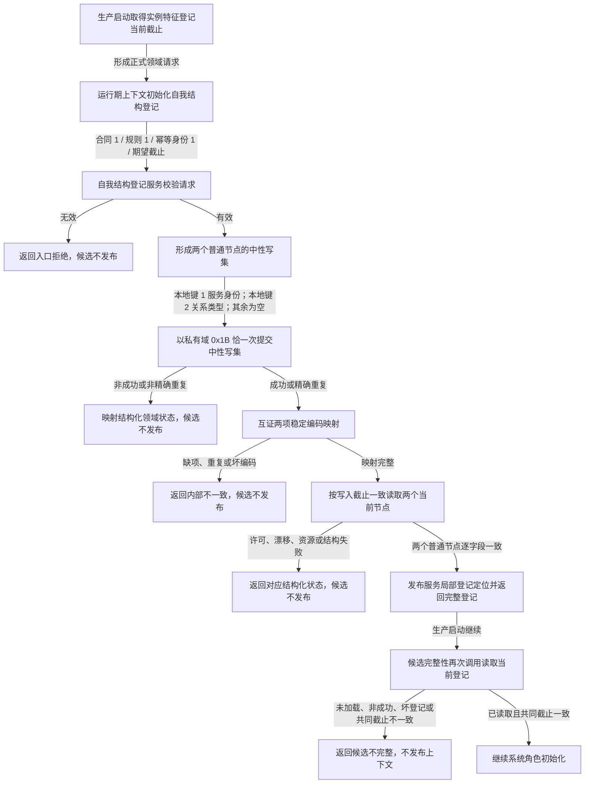

# 建立并接线自我结构关系登记函数流程图 v0.1

日期：2026-08-08

状态：设计流程；不证明代码已实现。

```mermaid
flowchart TD
    A["生产启动取得实例特征登记当前截止"] -->|"形成正式领域请求"| B["运行期上下文初始化自我结构登记"]
    B -->|"合同 1 / 规则 1 / 幂等身份 1 / 期望截止"| C["自我结构登记服务校验请求"]
    C -->|"无效"| R1["返回入口拒绝，候选不发布"]
    C -->|"有效"| D["形成两个普通节点的中性写集"]
    D -->|"本地键 1 服务身份；本地键 2 关系类型；其余为空"| E["以私有域 0x1B 恰一次提交中性写集"]
    E -->|"非成功或非精确重复"| R2["映射结构化领域状态，候选不发布"]
    E -->|"成功或精确重复"| F["互证两项稳定编码映射"]
    F -->|"缺项、重复或坏编码"| R3["返回内部不一致，候选不发布"]
    F -->|"映射完整"| G["按写入截止一致读取两个当前节点"]
    G -->|"许可、漂移、资源或结构失败"| R4["返回对应结构化状态，候选不发布"]
    G -->|"两个普通节点逐字段一致"| H["发布服务局部登记定位并返回完整登记"]
    H -->|"生产启动继续"| I["候选完整性再次调用读取当前登记"]
    I -->|"未加载、非成功、坏登记或共同截止不一致"| R5["返回候选不完整，不发布上下文"]
    I -->|"已读取且共同截止一致"| J["继续系统角色初始化"]
```

## 边界

- 第一层只接收两个普通节点和不透明幂等键，不理解自我结构语义。
- 本流程不创建完整自我、场景、存在或任何关系。
- 日志只供人观察，不参与任一分支裁决。
- 不包含崩溃、重启或跨进程恢复。
