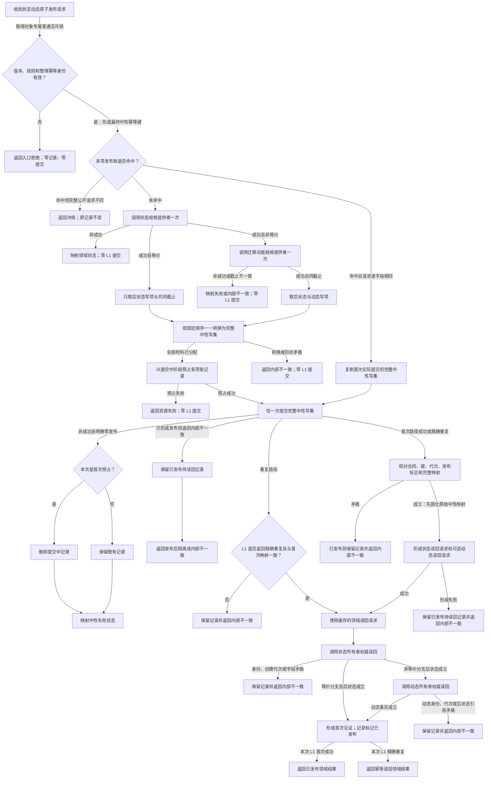

# L2-STATE-DYNAMIC-ATOMIC-PUBLISH-NEUTRAL-CRUD-MIGRATION 发布实际存在 I64 后继状态与迁移动能函数流程图 v0.1

日期：2026-08-08
状态：设计流程图；代码待实施

依据：`规范/详细设计/20260808_L2-STATE-DYNAMIC-ATOMIC-PUBLISH-NEUTRAL-CRUD-MIGRATION_状态动态原子联合发布中性CRUD迁移详细设计_v0.1.md`

本图只有一个公开根。缓存只保存首次完整请求、完整中性写集和读回定位，不直接产生成功；L1 和领域权威读回在每次同义请求中都必须真实执行。
