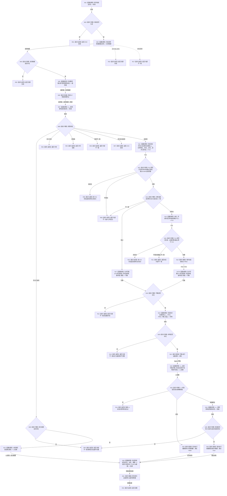

# L2-STATE-DYNAMIC-ATOMIC-PUBLISH-SERVICE-OWNER 发布实际存在 I64 后继状态与迁移动能函数流程图 v0.1

更新时间：2026-08-08

## 依据

```text
规范/0050_项目通用机器逻辑与禁止性规则总纲_20260721.md
规范/4015_子规范_L1简化事实基座.md v0.6
规范/4030_子规范_基础信息服务分层与领域写授权.md v1.4
规范/4040_子规范_不透明结构事务候选确认撤销与最后发布.md v1.4
规范/4050_子规范_入口拒绝逻辑内结果与内部逻辑错误.md v1.2
规范/4190_子规范_语义分层世界结构与状态动态因果边界.md v0.3
规范/4200_子规范_世界树业务服务与同代次完整事实快照.md v1.2
规范/0600_代码函数流程图应用与维护规范.md v0.4
规范/详细设计/20260808_L2-STATE-DYNAMIC-ATOMIC-PUBLISH-SERVICE-OWNER_状态动态原子发布服务对象前置详细设计_v0.1.md
当前代码基线 9b4f16d9d3d3fc379184333caac4597db880e03f
海中鱼巣/领域/服务.状态动态原子发布.ixx blob 6bed60a3dfff42928225d93323ed63fc5bdbc9a2
```

## 身份与边界

本图是服务对象前置叶的正式目标单函数施工图，只表达既有 legacy 发布正文迁入对象方法后的目标控制流。一图只有一个根方法；构造函数为纯引用绑定，不在本图展开。本图不把中性 CRUD、专属锁、首次写集缓存、运行期装配或世界树门面写成已实现目标。

## 函数合同

```text
根函数：状态动态原子发布服务::发布实际存在I64后继状态与迁移动能
归属模块 / 文件 / 层级：海中鱼巣.领域.服务.状态动态原子发布 / 海中鱼巣/领域/服务.状态动态原子发布.ixx / L2 状态动态原子组合发布者
现有或待新增：现有自由函数正文机械迁入待新增服务对象方法
完整签名：
状态动态原子发布结果 状态动态原子发布服务::发布实际存在I64后继状态与迁移动能(
    const 状态动态原子发布请求& 请求);
参数：请求为调用期间只读借用；非法合同、规则、幂等身份或后状态请求在 provider/L1 前拒绝
隐式对象：this 非拥有引用 L1_、实例特征_、状态_、比较_、动态_；未来装配保证其寿命覆盖调用
返回结果：状态动态原子发布结果；保持当前 legacy 成功、幂等读回和全部结构化非成功语义
被调函数流程图：既有 P13/P14/P15 和领域读回合同继续按当前有效设计；本叶不改其内部流程
```

## 流程图



## 节点合同

| 节点组 | 类型 | 参数 / 输入绑定 | 结果 / 输出绑定 | 事实读写 | 后继条件 | 验证 |
| --- | --- | --- | --- | --- | --- | --- |
| N01—N06 | 函数调用 / 本函数内判断与构造 | `请求`、`整理幂等身份` | 合法性、摘要、最终键、G7 意图 | 零事实读写 | 非成功立即返回；成功进入探测 | 与施工起点表达式逐项同一 |
| N07—N10 | 函数调用 / 判断 | 成员 `L1_` + 探测请求 | 探测或旧首次 L1 结果 | legacy 只读探测；零新发布 | 同义直接读回；未找到进入 provider | `L1` 形参只替换为 `L1_` |
| N11—N16 | 函数调用 / 判断 / 赋值 | 五个成员提供者 + `请求.后状态` | P13、可选 P14、PRE2 | 只读当前领域事实；零提交 | 等价不调 P14；非等价恰一次 | P13/P14 调用次数与参数不变 |
| N17—N21 | 函数调用 / 判断 / 赋值 | P13/P14、最终键、legacy 意图 | legacy 写集和执行证据材料 | 只形成调用方局部候选 | 材料完整才提交 | helper 与 DTO 不改签名 |
| N22—N29 | 函数调用 / 判断 / 赋值 | 成员 `L1_` + legacy 写集 | L1 结果、首次执行摘要、重复标志 | 恰一次 legacy 提交；重复时一次胜者探测 | 非成功返回；成功进入领域读回 | 操作标签、探测和提交次数不变 |
| N30—R17 | 函数调用 / 赋值 / 返回 | 成员 `状态_`、`动态_`、L1 结果和摘要 | 完整结构化发布结果 | 只读领域事实；不二次写 | 正常、资源和内部异常分账 | 结果字段与异常映射不变 |

## 关键边界

```text
本图的唯一改动是：自由函数五个服务参数 -> 同一服务对象五个私有引用成员。
本叶不新增 mutex、缓存、静态状态、运行期实例或门面调用。
旧六参数自由函数不保留兼容转发壳，否则会绕过下一叶唯一缓存所有者。
图中的 legacy 探测、G7、执行证据和提交不是目标中性合同；它们仅在所有权前置叶保持不变。
下一中性迁移叶必须基于本服务对象另建新设计和单根施工图，不能把本图当作中性 CRUD 已实现证据。
当前无合法生产调用点，全部业务运行场景保持未运行。
```
