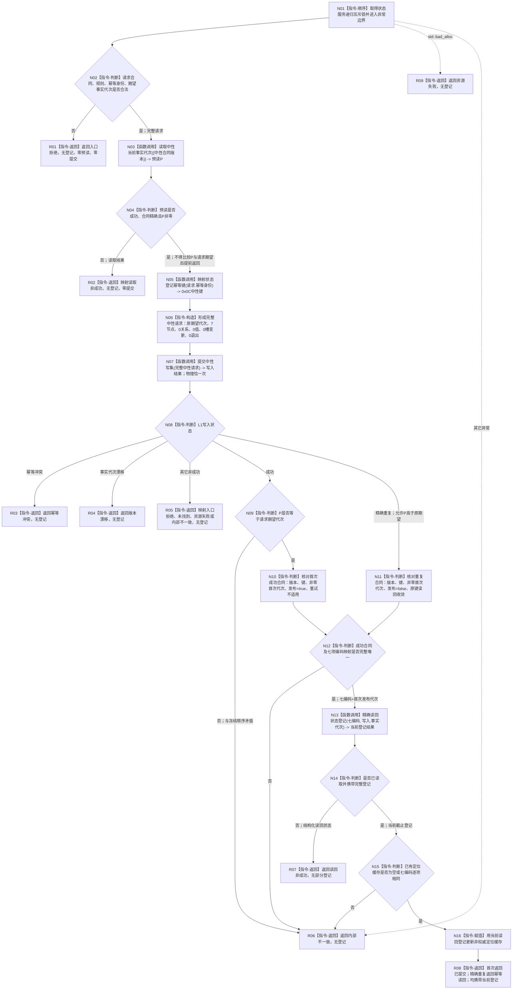

# L2-STATE-REGISTRY-NEUTRAL-WRITE-MIGRATION 建立登记函数流程图 v0.1

更新时间：2026-08-08

## 依据

```text
现行正式规范：0050、4015 v0.6、4030 v1.4、4040 v1.4、4050 v1.2
配套详细设计：20260808_L2-STATE-REGISTRY-NEUTRAL-WRITE-MIGRATION_状态结构登记中性写入迁移详细设计_v0.1.md
当前代码基线：main/origin/main 12087f6112b9698bf3503bbf81bf792dcf422a41
当前目标代码 blob：服务.L1状态.ixx=fec0d4f40454857f005c908677c4fdc29caab6fc
```

## 身份与边界

本图是后续代码实施的正式目标单函数图，不是当前实现事实，也不证明代码、构建、运行或真实消费者合同已经完成。

只画一个根函数及其直接调用。私有 `精确读回状态登记` 的 G0 + 七节点 + G1 合同由配套详细设计第 7 节冻结，本图只把它作为一个具名被调函数；不另建 HTML 或第二张函数图。

明确不画：`读取当前登记`、`发布实际存在I64首个基准状态`、基准状态读取、相邻前状态、后继状态、动态和 L1 内部事务实现。

## 函数合同

```text
根函数：L1状态服务::建立登记
归属模块 / 文件 / 层级：海中鱼巣.领域.服务.L1状态 / 海中鱼巣/领域/服务.L1状态.ixx / L2 状态领域
现有或待新增：现有公开函数，待迁移内部实现
完整签名：L1状态登记结果 建立登记(const L1状态登记请求& 请求)
参数：请求；const 引用输入；调用期间只读；必须满足合同版本、规则版本、幂等身份和期望事实代次约束
返回结果：L1状态登记结果；成功类为 已提交 或 幂等读回并携带完整当前登记；协议内非成功不携带登记
被调函数流程图：本包按用户指定只生成这一张根函数图；复杂读回 helper 的完整逐步合同见配套详细设计第 7 节
```

## 流程图



## 节点合同

| 节点 | 类型 | 参数 / 输入绑定 | 结果 / 输出绑定 | 事实读写 | 后继条件 | 验证 |
| --- | --- | --- | --- | --- | --- | --- |
| N01—N02 | 本函数内指令 | `请求` 只读引用 | 合法 / 非法 | 只写服务锁状态，不写事实 | 非法到 R01 | 非法请求零预读、零提交 |
| N03 | 函数调用 | `{L1中性CRUD合同版本}` | `预读P` | 只读当前事实代次 | 调用完成到 N04 | 合同、状态、P 非零 |
| N04 | 本函数内指令 | `预读P` | 健康 / 非成功 | 零事实写 | 健康到 N05 | 不得以 `P != 期望` 返回 |
| N05 | 函数调用 | `请求.幂等身份` | `0x0C` 中性键 | 纯值 | 键形成到 N06 | 域和 56 位边界 |
| N06 | 本函数内指令 | 请求、幂等键 | 固定七节点完整写集 | 仅本地不可变候选 | 构造完成到 N07 | `7/0/0/0/0` |
| N07 | 函数调用 | 完整中性请求 | `L1中性写入结果` | L1 唯一可能原子发布点 | 按状态到 N08 | 物理调用点恰一 |
| N08—N12 | 本函数内指令 | 写入结果、P、请求 | 业务状态或七编码 | 不新增事实 | 成功类到 N13 | 精确重复→冲突→漂移顺序由 L1 裁决 |
| N13 | 函数调用 | 七编码、首次发布代次 | 当前登记结果 | G0 + 七节点 + G1 只读 | 读回到 N14 | 详细设计第 7 节 |
| N14—N16 | 本函数内指令 | 当前登记、既有缓存 | 更新后的定位缓存 | 只写非权威缓存 | 成功到 R08 | 七编码一致；截止允许推进 |
| R01—R09 | 本函数内指令 | 对应分支状态 | `L1状态登记结果` | 无新增事实写；R08 前事实只可能由 N07 发布 | 返回调用方 | 非成功无登记；成功类具名 |

## 关键边界

```text
提交前预读P只证明入口健康，不得阻断原请求精确重复。
L1最终顺序：精确重复 -> 同键异义 -> legacy键占用 -> 期望代次漂移 -> 首次候选。
本根不调用旧探测、完整快照、legacy提交，不形成0x15000601领域意图。
发布成功后读回失败不撤销已发布事实。
第二个0x0D首态发布根及其它状态/动态逻辑不在本图和本叶范围。
```
