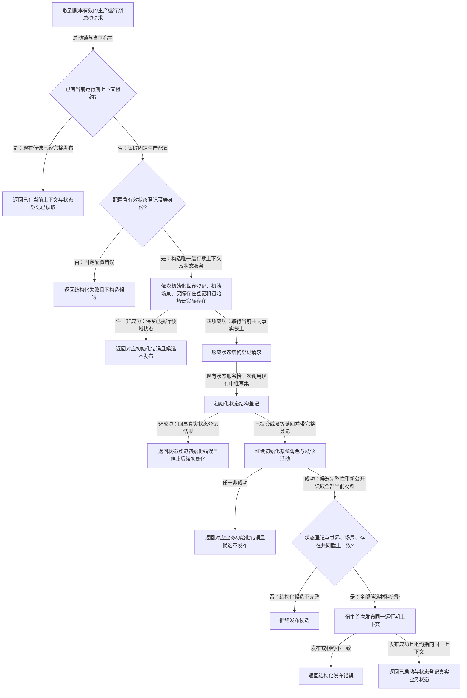

# 生产运行期初始化状态结构登记函数流程图 v0.1

日期：2026-08-08

状态：目标函数流程设计；不表示代码已经实现或运行。

目标函数：`生产运行期会话::启动`

```mermaid
flowchart TD
    A["收到版本有效的生产运行期启动请求"] -->|"启动锁与当前宿主"| B{"已有当前运行期上下文租约?"}
    B -->|"是：现有候选已经完整发布"| C["返回已有当前上下文与状态登记已读取"]
    B -->|"否：读取固定生产配置"| D{"配置含有效状态登记幂等身份?"}
    D -->|"否：固定配置错误"| E["返回结构化失败且不构造候选"]
    D -->|"是：构造唯一运行期上下文及状态服务"| F["依次初始化世界登记、初始场景、实际存在登记和初始场景实际存在"]
    F -->|"任一非成功：保留已执行领域状态"| G["返回对应初始化错误且候选不发布"]
    F -->|"四项成功：取得当前共同事实截止"| H["形成状态结构登记请求"]
    H -->|"现有状态服务恰一次调用现有中性写集"| I["初始化状态结构登记"]
    I -->|"非成功：回显真实状态登记结果"| J["返回状态登记初始化错误且停止后续初始化"]
    I -->|"已提交或幂等读回并带完整登记"| K["继续初始化系统角色与概念活动"]
    K -->|"任一非成功"| L["返回对应业务初始化错误且候选不发布"]
    K -->|"成功：候选完整性重新公开读取全部当前材料"| M{"状态登记与世界、场景、存在共同截止一致?"}
    M -->|"否：结构化候选不完整"| N["拒绝发布候选"]
    M -->|"是：全部候选材料完整"| O["宿主首次发布同一运行期上下文"]
    O -->|"发布或租约不一致"| P["返回结构化发布错误"]
    O -->|"发布成功且租约指向同一上下文"| Q["返回已启动与状态登记真实业务状态"]
```

边界：本流程只增加真实第二层状态结构登记初始化。它不运行第一层测试，不创建首个基准状态，不启动动态或因果消费者，也不以日志或退出码替代结构化状态和权威读回。
