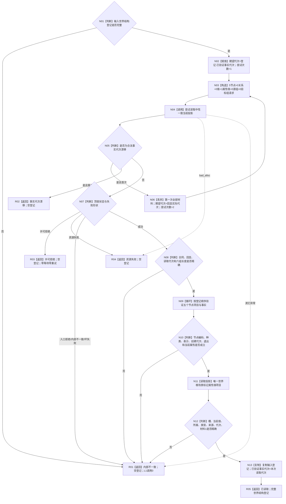
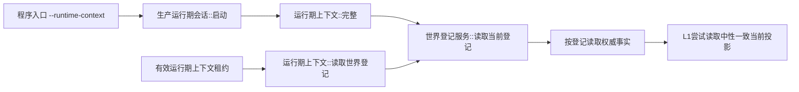

# L2-WORLD-REGISTRY-CURRENT-READ-CONSISTENT-PROJECTION-MIGRATION
# 按登记读取权威事实函数流程图 v0.1

日期：2026-08-08

对应详细设计：`规范/详细设计/20260808_L2-WORLD-REGISTRY-CURRENT-READ-CONSISTENT-PROJECTION-MIGRATION_世界登记当前读回一致投影迁移详细设计_v0.1.md`

实现基线：`0a90eb9f9011758ce6fd5803121b172785e1cb7f`

目标函数：`世界登记服务::按登记读取权威事实(const 世界结构登记&) const`

物理位置：`海中鱼巣/领域/服务.世界登记.ixx`

偏差身份：`L2-WR-READ-D01`

## 1. 目标函数流程



## 2. 节点合同

| 节点 | 输入 | 输出 | 事实 / 许可边界 | 验证重点 |
| --- | --- | --- | --- | --- |
| N01 | 值式登记定位 | 输入资格 | 零 L1 调用 | 合同 / 规则 / 幂等 / 五编码 / 已验证代次完整 |
| N03 | 期望代次与五编码 | 中性一致请求 | 零事实访问 | `5/0/0/1/0/0`，世界根可同时在节点和属性值组 |
| N04 | 完整请求 | 中性一致结果 | 每次内部共享 try-lock 恰一次 | 不取得仓、锁、许可或内部句柄 |
| N05—N06 | 顶层漂移与回显实际代次 | 最多一次完整重试 | 第一次材料全部丢弃 | 漂移组全空；实际代次非零；许可拒绝不重试 |
| N08 | 顶层成功 | 可解释投影 | 单次共同读取代次 | 合同、期望回显、读取代次、六组长度 |
| N09—N10 | 五节点结果 | 世界登记节点形状 | 只读值式事实 | 五节点同创建代次；一属性类型 I64；前四无属性；根一属性 |
| N11—N12 | 唯一属性值投影 | 根场景标记形状 | 槽和值同一次许可 | 根 + 标记类型 + 来源服务 + I64(1) + 未退出 |
| N13 | 输入登记与本次截止 | 新登记副本 | 不修改缓存 | 只更新已验证事实代次 |
| R01—R04 | 结构化非成功 | 空登记 | 零写 | 入口坏成功归内部；许可、资源、漂移保持分账 |
| R05 | 完整业务事实 | 已读取登记 | 调用方拥有值式副本 | 不宣称相邻消费者或 L1 完善 |

## 3. 固定请求形状

```text
节点：服务身份、场景标记属性类型、直接父场景关系类型、直接成员关系类型、世界根场景
关系：空
值：空
属性值：(世界根场景, 场景标记属性类型)
源关系组：空
目标关系组：空
```

禁止预读值编码、调用旧当前事实代次 / 节点 / 属性 / 值入口，禁止完整快照、历史、审计、恢复、SQL、索引、缓存、等待、第三次尝试或任何写入。

## 4. 正式生产调用边



生产运行和公开读回都经同一目标根，不新增消费者驱动或第二解释入口。

## 5. 完成边界

本图是目标施工流程，不是当前实现事实。计划提交、流程图生成、构建通过和生产退出码均不单独证明结构化业务成功；施工后还须按实际代码更新现状图谱并由合法公开读回核对最终世界登记。
