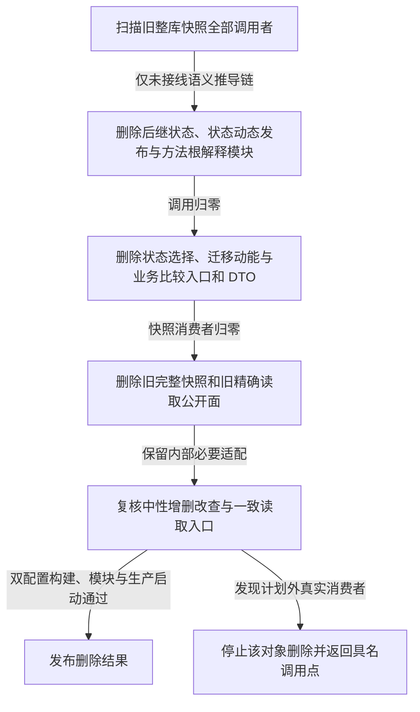

# 删除旧整库快照与语义推导死链流程图 v0.1

```mermaid
flowchart TD
    A["扫描旧整库快照全部调用者"] -->|"仅未接线语义推导链"| B["删除后继状态、状态动态发布与方法根解释模块"]
    B -->|"调用归零"| C["删除状态选择、迁移动能与业务比较入口和 DTO"]
    C -->|"快照消费者归零"| D["删除旧完整快照和旧精确读取公开面"]
    D -->|"保留内部必要适配"| E["复核中性增删改查与一致读取入口"]
    E -->|"双配置构建、模块与生产启动通过"| F["发布删除结果"]
    E -->|"发现计划外真实消费者"| G["停止该对象删除并返回具名调用点"]
```

最大边界：不把旧语义链迁移到中性读取，不删除仍有真实调用者的中性结构服务，也不宣称数据层整体完成。
