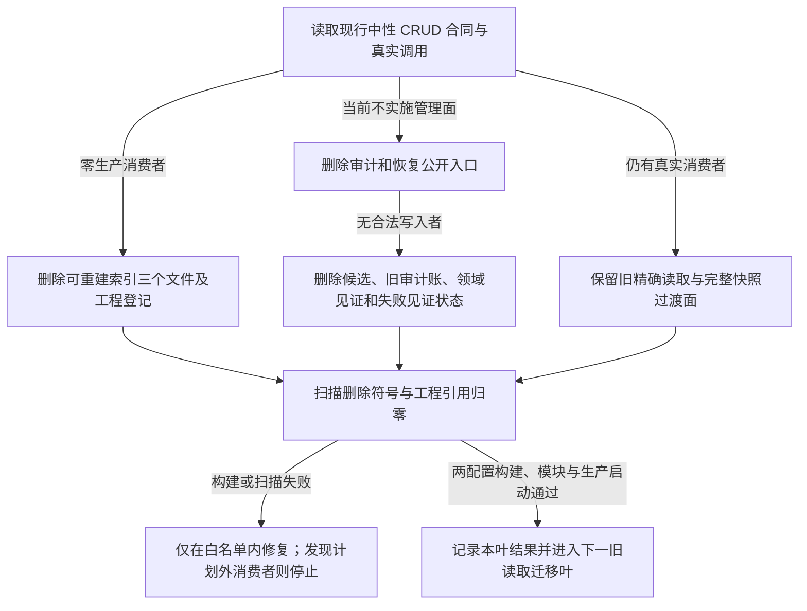

# 删除 L1 核心无效索引与恢复管理实现流程图 v0.1

```mermaid
flowchart TD
    A["读取现行中性 CRUD 合同与真实调用"] -->|"零生产消费者"| B["删除可重建索引三个文件及工程登记"]
    A -->|"当前不实施管理面"| C["删除审计和恢复公开入口"]
    C -->|"无合法写入者"| D["删除候选、旧审计账、领域见证和失败见证状态"]
    A -->|"仍有真实消费者"| E["保留旧精确读取与完整快照过渡面"]
    B --> F["扫描删除符号与工程引用归零"]
    D --> F
    E --> F
    F -->|"构建或扫描失败"| G["仅在白名单内修复；发现计划外消费者则停止"]
    F -->|"两配置构建、模块与生产启动通过"| H["记录本叶结果并进入下一旧读取迁移叶"]
```

最大边界：本流程只退出零消费者索引和当前不实施的恢复管理代码，不删除仍有调用者的旧读取，不证明 L1 已完善。
