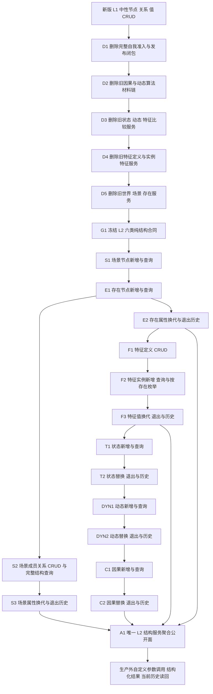

# L2 旧链清理与六类结构 CRUD 分步路线图 v0.1

日期：2026-08-10

设计身份：`L2-STRUCTURE-CRUD-REBUILD`

路线说明：

- 删除按反向依赖从最高层向底层推进，任何集合外生产消费者都会阻断对应删除叶。
- 新建按真实结构依赖推进；层号不形成逐层转发。
- 每个 CRUD 叶只验证本叶公开入口，不使用日志、生产内自检或业务真实性剧本。
- 轮廓只是特征类型化参数之一，统一走特征结构服务，不建立轮廓专用 CRUD。
