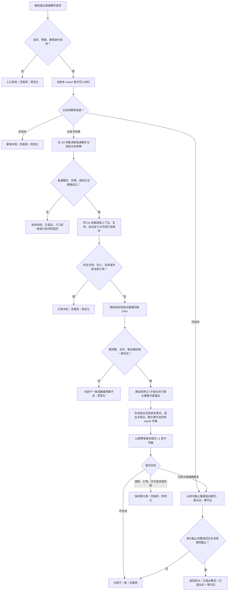

# 退出普通概念函数流程图

日期：2026-08-17

版本：v0.1

身份：`DATA-L2-CONCEPT-DEFINITION-CONTRACT-READ-AND-EXIT-CLOSURE`

目标函数：`L2概念结构服务::退出普通概念(const L2普通概念退出请求&)`

边界：本函数不退出名称、世界事实、支持或其它概念定义，不级联跨 owner 事实，不原地改写定义签名，不把日志当机器事实。
